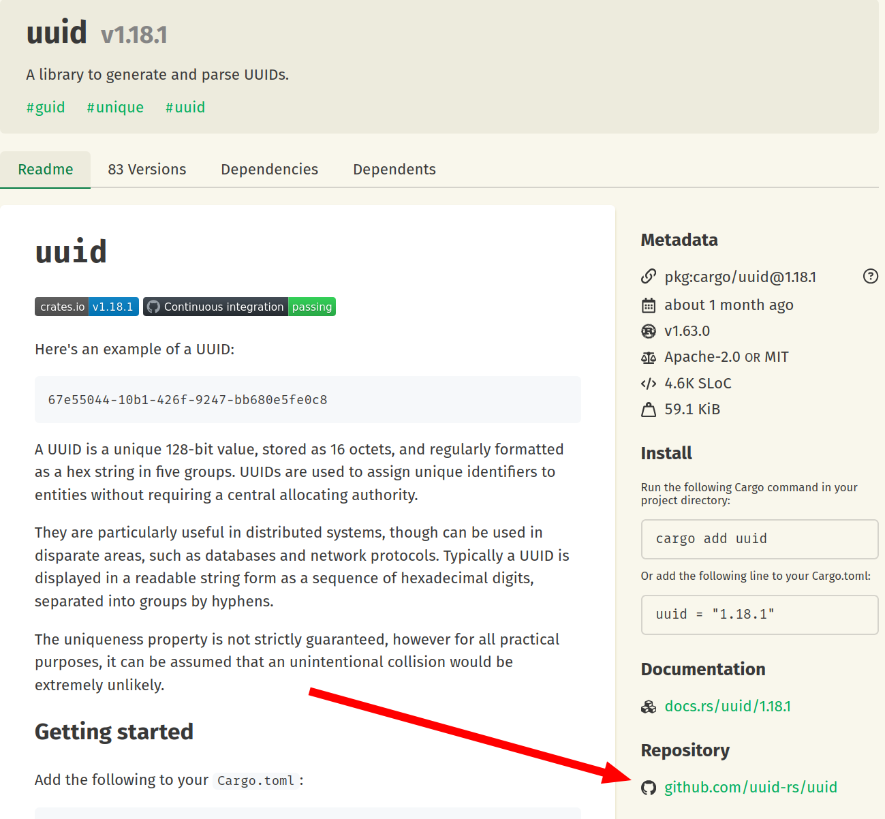

# Dependencies

Almost any real-world program uses a number of third-party libraries in addition to the standard library. When a library is required to build a program, we say that the program **depends** on that library.

The `[dependencies]` section in the `Cargo.toml` file is used specifically to define these dependencies.

## Dependency Usage Example

Let's assume we decided to write a "coin toss" style program that randomly prints "YES" or "NO" when launched.

The problem is that the Rust standard library lacks built-in functionality for generating random numbers. The standard solution is to use a third-party library called rand. Let's look at the implementation first, and then we'll break down what we used and where it came from.

1\) Create a new project:

```
cargo new decision_maker --bin
```

2\) In `Cargo.toml`, add a dependency for the rand library, version `0.9` (the current version at the time of writing).

```toml
[package]
name = "decision_maker"
version = "0.1.0"
edition = "2024"

[dependencies]
rand = "0.9"
```

3\) In the main program file `src/main.rs`, write the following:

```rust,noplayground
use rand::random;

fn main() {
    let is_yes: bool = random();
    if is_yes {
        println!("YES");
    } else {
        println!("NO");
    }
}
```

4\) Build the application:

```
$ cargo build
   Compiling libc v0.2.176
   Compiling cfg-if v1.0.3
   Compiling zerocopy v0.8.27
   Compiling getrandom v0.3.3
   Compiling rand_core v0.9.3
   Compiling ppv-lite86 v0.2.21
   Compiling rand_chacha v0.9.0
   Compiling rand v0.9.2
   Compiling decision_maker v0.1.0 (/home/stas/dev/proj/rust/decision_maker)
    Finished `dev` profile [unoptimized + debuginfo] target(s) in 1.60s
     Running `target/debug/decision_maker`
```

And run it:

```
$ ./target/debug/decision_maker
YES
```

It works! Now, let’s analyze what we just did.

## The Repository of Libraries

In `Cargo.toml`, we added `rand = "0.9"`. This connected the [rand](https://crates.io/crates/rand) library version `0.9` to our project. But how does this library actually get to our machine?

The thing is that there is a centralized repository for Rust libraries — [crates.io](https://crates.io).

When Cargo encounters a library entry in the `[dependencies]` section of `Cargo.toml`, it downloads the source code for that library from crates.io. If that library has its own <ins>transitive dependencies</ins>, Cargo automatically downloads those as well.

In the previous example, when we ran `cargo build`, you could see in the build log how Cargo compiled rand along with all its transitive dependencies: `libc`, `cfg-if`, `zerocopy`, and so on.

## Finding Libraries

The question remains: how did we know about the rand library in the first place?

When working with Rust, finding libraries is no different than in any other programming language: you search the internet. If you type a query into a search engine (or ask an AI assistant) about how to generate a random number in Rust, the first recommendation will almost certainly be an example using the `rand` library.

You can also check out [awesome-rust](https://github.com/awesome-rust-com/awesome-rust), a curated collection of popular Rust libraries and programs.

## Viewing the Dependency Tree

To see all the dependencies Cargo downloaded for our project, including transitive ones, you can use the `cargo tree` command:

```
$ cargo tree
decision_maker v0.1.0 (/home/user/projects/rust/decision_maker)
└── rand v0.9.2
    ├── rand_chacha v0.9.0
    │   ├── ppv-lite86 v0.2.21
    │   │   └── zerocopy v0.8.27
    │   └── rand_core v0.9.3
    │       └── getrandom v0.3.3
    │           ├── cfg-if v1.0.3
    │           └── libc v0.2.176
    └── rand_core v0.9.3 (*)
```

As you can see, our project has only one top-level dependency — `rand`, but `rand` itself depends on eight other crates.

## Library Features

Quite often, some of a library's functionality is "turned off" by default. To "turn it on", when declaring the dependency you need to specify a specific flag — **feature**.

For example, let’s say we want to write an application that generates UUIDs (Version 4) according to the UUID specification.

First, create the project:

```
cargo new uuid_v4_generator
```

On crates.io there is a library called [uuid](https://crates.io/crates/uuid), that supports UUID versions 1 through 7. Let's add it to our dependencies:

```toml
[package]
name = "uuid_v4_generator"
version = "0.1.0"
edition = "2024"

[dependencies]
uuid = "1"
```

After reviewing the uuid library documentation, we might write the following code in `src/main.rs` to generate a UUID v4:

```rust,noplayground
use uuid::Uuid;

fn main() {
    let uuid_v4 = Uuid::new_v4();
    println!("UUID: {uuid_v4}");
}
```

However, when attempting to build the program, we discover that the `Uuid::new_v4` method is unavailable. This is because, by default, functionality related to UUID v4 is "turned off". To enable it, we must declare the `uuid` dependency like this:

```toml
[package]
name = "uuid_v4_generator"
version = "0.1.0"
edition = "2024"

[dependencies]
uuid = { version = "1", features = ["v4"] }
```

Now everything should work. Let's build and run the program:

```
$ cargo run
   Compiling libc v0.2.180
   Compiling getrandom v0.3.4
   Compiling cfg-if v1.0.4
   Compiling uuid v1.19.0
   Compiling test_rust v0.1.0 (/home/stas/dev/proj/test_rust)
    Finished `dev` profile [unoptimized + debuginfo] target(s) in 1.26s
     Running `target/debug/test_rust`
UUID: 38cfd8a3-06c1-4c90-905c-59c2b010ad0a
```

***

How do I find out which features a library provides?

Typically, information about available features and their descriptions is found in the official documentation hosted on the library's crates.io page.

However, the most reliable source of information is the `[features]` section in the crate's own `Cargo.toml`.

For instance, on the [uuid crate page](https://crates.io/crates/uuid) on crates.io, there is a link to the [github repository](https://github.com/uuid-rs/uuid) containing the source code.



By navigating to the repository and opening `Cargo.toml`, we can easily find the `[features]` section:

```toml
[features]
default = ["std"]
std = ["wasm-bindgen?/std", "js-sys?/std"]
v1 = ["atomic"]
v3 = ["md5"]
v4 = ["rng"]
v5 = ["sha1"]
v6 = ["atomic"]
v7 = ["rng"]
v8 = []
js = ["dep:wasm-bindgen", "dep:js-sys"]
```

In this list, `default` contains the features enabled by default. Everything that follows: `std`, `v1`, `v2`, etc. — represents available features. If a feature is not in the `default` list, it is "off" by default, and its functionality cannot be used until explicitly enabled.

## Dependency Versions

In Rust, crates generally follow [Semantic Versioning (SemVer](https://semver.org/lang/).

The principle is as follows:

* A version consists of three numbers separated by dots: `major.minor.patch`.
* Major: Incremented for changes that break backward compatibility.
* Minor: Incremented for adding functionality in a backward-compatible manner.
* Patch: Incremented for backward-compatible bug fixes.

Why does this matter? By default, Cargo downloads the <ins>latest compatible</ins> API version.

For example, at the time of writing, the latest version of the `uuid` library was `1.18.1`. Even though we specified `version = "1"` in our `Cargo.toml`:

```toml
uuid = { version = "1", features = ["v4"] }
```

The actual version Cargo resolved to was `1.18.1`:

```
$ cargo tree
test_rust v0.1.0 (/home/user/projects/uuid_v4_generator)
└── uuid v1.18.1
    └── getrandom v0.3.3
        ├── cfg-if v1.0.3
        └── libc v0.2.176
```

What if we explicitly specify version `1.17.0`?

```toml
uuid = { version = "1.17.0", features = ["v4"] }
```

Nothing changes. Cargo will still insist on pulling the latest compatible minor version — `1.18.1`.

This behavior is logical under SemVer rules. However, we don't live in an ideal world, and you might encounter a situation where the latest minor version is API-compatible but contains a bug. In such cases, you can force a specific version using the `=` sign:

```toml
uuid = { version = "=1.17.0", features = ["v4"] }
```

Now Cargo pulls exactly the version specified:

```
$ cargo tree
test_rust v0.1.0 (/home/user/projects/uuid_v4_generator)
└── uuid v1.17.0
    └── getrandom v0.3.3
        ├── cfg-if v1.0.3
        └── libc v0.2.176
```

---

It is important to note that the principle of selecting the “latest API-compatible version” does not always mean the “latest minor version.” For libraries whose major version is zero, minor versions are considered API-incompatible. That is, versions `0.3.0` and `0.4.0` are treated as incompatible. In such cases, Cargo will select the latest patch release, but only within the specified minor version.

For example, if we specify the dependency:

```toml
rand = "0.8"
```

then, despite the fact that the most recent version on crates.io is `0.9.2`, Cargo will take version `0.8.5` — the most recent patch version for `0.8`.

## Cargo.lock

When Cargo first fetches your dependencies, it creates a `Cargo.lock` file right next to your `Cargo.toml`.

In `Cargo.lock`, Cargo records the exact version numbers that were downloaded from crates.io during the project's initial build. From that point on, Cargo will continue to use these specific versions, even if newer compatible versions become available on crates.io.

For example, let's say we included the `rand` library like this:

```
rand = "0.8"
```

At the time of the first `cargo build` command, the latest compatible version of rand was `0.8.2`. This means Cargo recorded `rand = "0.8.2"` in the `Cargo.lock` file.
Later, a newer compatible version, `0.8.3`, is released on crates.io. Cargo will still continue to use version `0.8.2` because it is "locked" in the `Cargo.lock` file.

However, if we delete the current `Cargo.lock` file, Cargo will create a new one and lock in the latest versions available at that moment.

***

Why is all this necessary? As we mentioned, Cargo tries to fetch the latest compatible versions of libraries. However, since new library versions can often introduce unexpected bugs, it is vital to have the ability to stick to a known, working configuration. This is exactly what `Cargo.lock` is for.

Want to update? Just delete `Cargo.lock`. Want to stay on a familiar and stable combination of versions? Just leave `Cargo.lock` alone.

***

It should also be noted that when developing libraries, it is recommended to commit `Cargo.lock` to the code repository. Conversely, when developing end-user executable applications, `Cargo.lock` is typically not committed to the repository.

