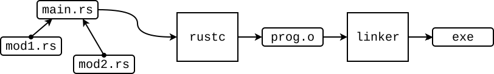
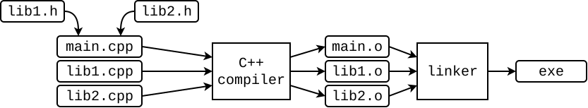
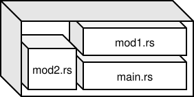

# Modules

In Rust programs, to avoid naming conflicts and to logically structure code, data types and functions are usually grouped into **modules**.

> [!TIP]
> Modules are somewhat analogous to namespaces in C++ or packages in Java.

There are several ways to create a module.

## Method 1: The `mod {…}` Block

A module can be declared directly in `main.rs` using the `mod` keyword.

```rust,noplayground
mod module_name {
    // content
}
```

To call a function or access a structure from a module, use the following syntax:

```
module::name
```

Let's look at an example: resolving a naming conflict using modules.

File `main.rs`:

```rust
mod a {
    pub fn get_num() -> i32 {
        1
    }
}

mod b {
    pub fn get_num() -> i32 {
        2
    }
}

fn main() {
    println!("{}", a::get_num()); // 1
    println!("{}", b::get_num()); // 2
}
```

To not write the full name (module + function/struct), you can import the name using `use` keyword:

```rust
mod my_module {
    pub fn get_num() -> i32 {
        5
    }
}

use my_module::get_num; // importing get_num

fn main() {
    println!("{}", get_num());
}
```

Note the `pub` (public) visibility modifier placed before the function declaration. It indicates that the function can be used by "external" code. By default, everything inside a module is private and can only be used within that module.

```rust
mod my_module {
    pub fn get_num() -> i32 { // visible outside the module
        get_5()
    }
    fn get_5() -> i32 { // visible only inside the module
        5
    }
}

fn main() {
    println!("{}", my_module::get_num()); // 5
}
```

Typically, the `mod {…}` block is used:

* To resolve naming conflicts in the same file.
* To separate a block of code (module) that only compiles under a specific condition, e.g. only for running tests.


## Method 2: A Separate `*.rs` File

If you create another file with the `*.rs` extension in the same directory as `main.rs`, you can include it as a module using the `mod` keyword.

```rust,noplayground
mod file_name_without_rs;
```

For example, suppose we have the two files: `main.rs` and `my_module.rs`.

_main.rs_:
```rust
mod my_module;

fn main() {
  println!("{}", my_module::get_num());
}
```
_my_module.rs_:
```rust
pub fn get_num() -> i32 {
  5
}
```

Compile and run:

```
$ rustc main.rs
$ ./main
5
```

> [!NOTE]
> To put it simply: during compilation, the `mod my_module` expression is replaced by the contents of `my_module.rs`, as if that code were originally there and wrapped in a `mod my_module { ... }` block.
> 
> ```rust
> mod my_module {
>     pub fn get_num() -> i32 {
>         5
>     }
> }
> 
> fn main() {
>     println!("{}", my_module::get_num());
> }
> ```

Same as with `mod {…}`, to avoid typing the full module path every time, you can import functions using the `use` directive.

```rust,noplayground
mod my_module;
use my_module::get_num;

fn main() {
    println!("{}", get_num());
}
```

Creating a module as a separate `*.rs` file is ideal when the entire module's code fits into a single file.

## Method 3: Directory and mod.rs

If a module's functionality is highly granular and can be split into several submodules, the module can be created as a separate directory rather than a single file. This directory should contain a root file named `mod.rs` and other `*.rs` files that serve as sub-modules.

Let's look at a trivial module for arithmetic operations:

```
src/
├── main.rs           <- main program file
└── my_math/          <- module folder
    └── mod.rs        <- root module file
        ├── add.rs    <- "add" function is here
        └── mul.rs    <- "multiply" function is here
```

Program files:

* File `my_math/mod.rs`:
  ```rust,noplayground
  pub mod add; // includes add.rs into the my_math module
  pub mod mul; // includes mul.rs into the my_math module
  ```

* File `my_math/add.rs`:
  ```rust,noplayground
  pub fn sum(a: i32, b: i32) -> i32 {
      a + b
  }
  ```

* File `my_math/add.rs`:
  ```rust,noplayground
  pub fn multiply(a: i32, b: i32) -> i32 {
      a * b
  }
  ```
* File `main.rs`:
  ```rust,noplayground
  mod my_math;
  use my_math::add::sum;
  use my_math::mul::multiply;
  
  fn main() {
      println!("2 + 3 = {}", sum(2, 3));
      println!("2 * 3 = {}", multiply(2, 3));
  }
  ```

Compile and run:

```
$ rustc main.rs
$ ./main
7
```

> [!NOTE]
> With some simplification we can say that during the compilation of `main.rs`, the compiler includes all modules into the `main.rs`, like if the modules code had been placed in it using `mod {}` block.
> 
> ```rust
> mod my_math {
>     pub mod add {
>         pub fn sum(a: i32, b: i32) -> i32 {
>             a + b
>         }
>     }
>     pub mod mul {
>         pub fn multiply(a: i32, b: i32) -> i32 {
>             a + b
>         }
>     }
> }
> use my_math::add::sum;
> use my_math::mul::multiply;
> 
> fn main() {
>     println!("2 + 3 = {}", sum(2, 3));
>     println!("2 * 3 = {}", multiply(2, 3));
> }
> ```

## Translation and Modules

As we saw before, when we create modules as separate files, we do not need to compile them individually. We only invoke `rustc` for the `main.rs` file, and all associated modules are compiled automatically.

The assembly of a binary executable can be illustrated as follows:



For comparison: in C++, each *.cpp file is compiled into a separate object file. After that all object files are linked together into an executable binary.



Because the Rust compiler "merges" `main.rs` and all its included modules into one large file, which it then compiles as a whole, this `main.rs` and all nested modules are called a **crate**. Imagine as if all the files were "tossed" into a single box (a translation unit) and fed into the compiler.



The concept of a crate is very important to the Rust ecosystem. We will discuss crates and other components of Rust programs in more detail in the chapter [Multiple Binary Files](../project/multiple-bin.md).
