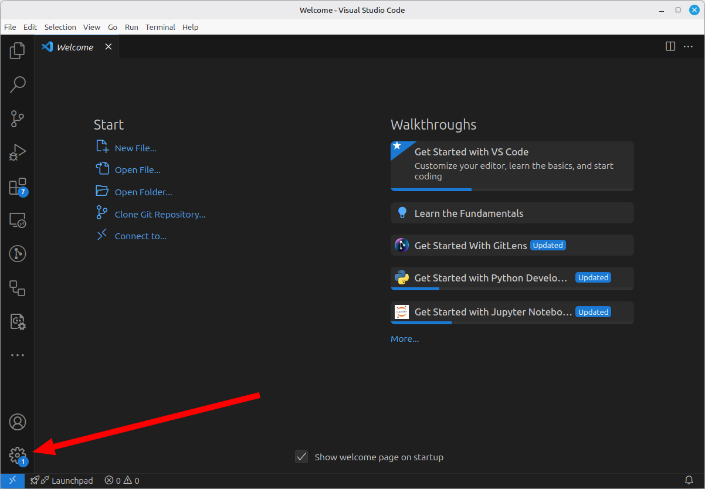
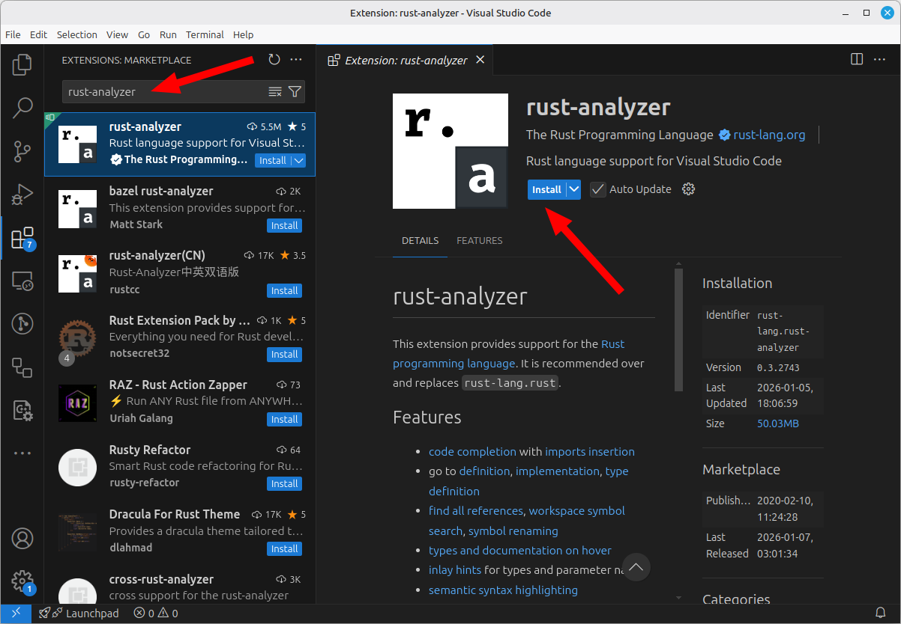
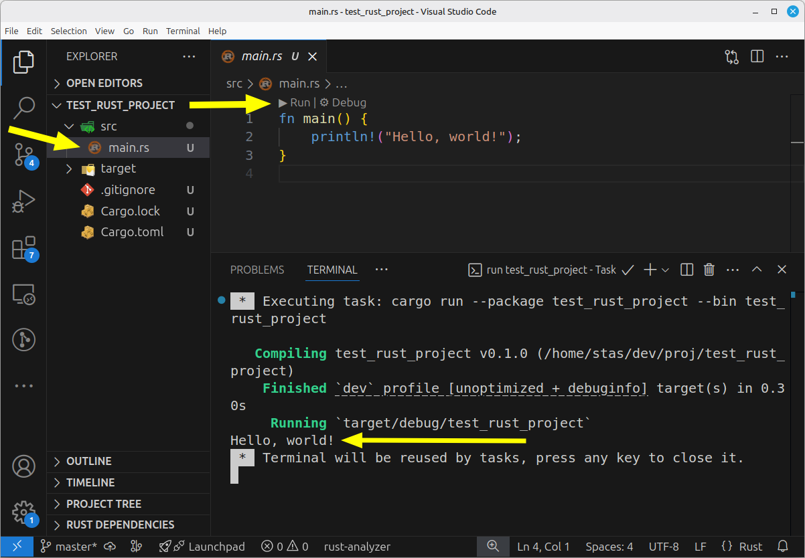
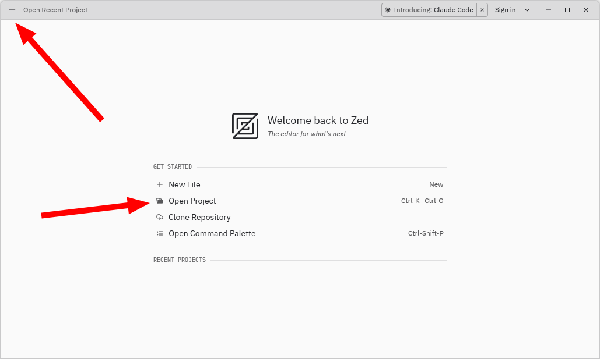
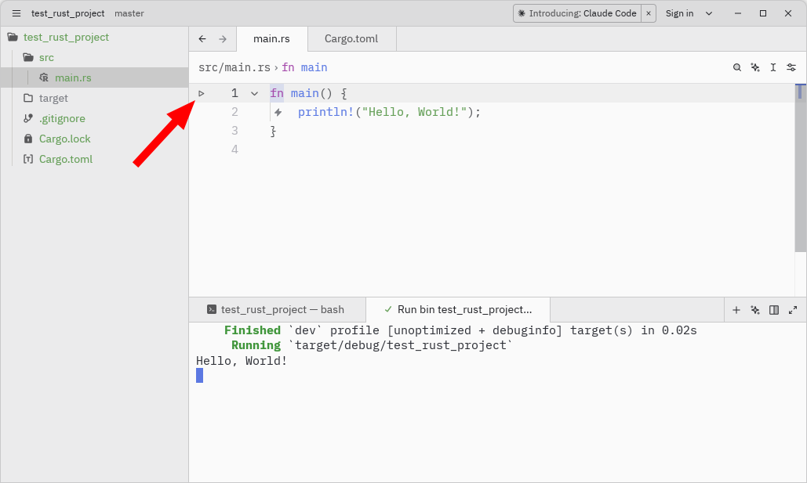

# Среда разработки

Кроме самого Rust тулчейна, вам, очевидно, понадобится редактор кода или среда разработки с поддержкой Rust. Популярные варианты:

* [Rust Rover](https://www.jetbrains.com/rust/) — очень мощная IDE от JetBrains специльно для Rust. Бесплатна для Open-Source разработки и обучения, но для коммерческий разработки придётся купить лицензию.
* [VSCode](https://code.visualstudio.com/) — мощная, бесплатная и очень гибкая среда разработки с открытым исходным кодом.
* [Zed](https://zed.dev/) — новая, бесплатная и очень быстрая среда разработки, написанная на Rust.
* [NeoVim](https://neovim.io/) — мощный консольный редактор с высоким порогом входа, но большой гибкостью и расширяемостью. NeoVim — это форк оригинального [Vim](https://www.vim.org/), в котором для написания плагинов вместо VimScript используется Lua.
* [Helix](https://helix-editor.com/) — "клон" Vim, написанный на Rust. Не так гибок, как NeoVim, но дружественнее и проще.

Если вы уже пользуетесь одной из IDE от Jet Brains, при этом вам подходит как она сама, так и её лицензия и стоимость, то можете просто ставить Rust Rover и переходить к следующей главе.

## rust-analyzer

Из всех вышеперечисленных сред разработки, только Rust Rover имеет собственную реализацию парсера и анализатора Rust кода. Все остальные работают с Rust кодом посредством [rust-analyzer](https://rust-analyzer.github.io/).

rust-analyzer — приложение, которое анализирует код на Rust и предоставляет такие возможности как:

* выведение типов
* автодополнение
* переход к объявлению переменной/функции/типа
* поиск всех использований функции/типа
* и т.д.

Редакторы кода взаимодействуют с rust-analyzer при помощи LSP (Language Server Protocol) — протокола, разработанного специально для взаимодейсвтия между редакторами и анализаторами кода.


Всё это значит, что перед тем как любой из вышеперечисленных редакторов сможет работать с Rust, вам необходимо установить rust-analyzer. Сделать это можно при помощи команды:

```
rustup component add rust-analyzer
```

После этого можно приступать к установке и настройке IDE.

## VSCode

Если вы не работали со средами разработки от JetBrains или работали, но они вам не подходят, то первое, что рекомендуется попробовать —  VSCode.

VSCode представляет из себя редактор кода, который изначально не умеет ничего кроме редактирования, но имеет обширную базу плагинов, способных легко превратить VSCode в мощную IDE.

Для начала скачайте VSCode с официального сайта: [https://code.visualstudio.com/download](https://code.visualstudio.com/download). На сайте имеются варианты скачивания в виде :

* инсталлятора для Windows
* пакетов для Linux
* просто архива

Выбирайте то, что вам удобнее.

После скачивания, запустите VSCode и перейдите в плагины, щёлкнув на иконке как на изображении ниже:



В появившемся контекстном меню выберите пункт "Extension", после чего перед вами должна открыться следующая панель:



В левом верхнем углу находится поле ввода для поиска расширений. Введите в него "rust-analyzer", и после того как расширение отобразится, нажмите "install".

В принципе, этого уже достаточно, чтобы начать работать с Rust. Однако, рекомендуется так же установить следующие расширения:

* Even Better TOML — подсветка синтаксиса для TOML файлов\
  ([ссылка на страницу плагина](https://marketplace.visualstudio.com/items?itemName=tamasfe.even-better-toml))
* vscode-icons — более интуитивные пиктограммы в дереве файлов\
  ([ссылка на страницу плагина](https://marketplace.visualstudio.com/items?itemName=vscode-icons-team.vscode-icons))\
  После установки выберите в меню:\
  File -> Preferences -> Theme -> File Icon Theme -> VSCode Icons

***

Теперь протестируем, что всё работает.

Создайте Rust проект: откройте консоль, перейдите в удобный каталог (командой `cd`) и выполните следующую команду:

```
cargo new test_rust_project
```

Эта команда создаст новую директорию `test_rust_project` с проектом.

В VSCode выберите в меню "File -> Open Folder" и укажите папку `test_rust_project`.

После этого должен открыться ваш свежесозданный проект. Слева в дереве файлов щёлкните на src/main.rs, после чего справа в редакторе кода появится содержимое файла.

Над главной функцией (`fn main`) должна отображаться стрелочка с надписью "Run".



Нажмите на "Run". Если после этого в нижней части окна появится терминал, в котором отобразится строка "Hello, World!", то значит всё настроено верно.

## Zed

Zed — молодая (первый бета релиз в 2023-м году) среда разработки, написанная на Rust и WGPU (библиотека для кроссплатформенной работы с графикой на GPU).

Основным фокусом Zed является производительность и эффективное использование аппаратных ресурсов. Если вы чувствительны к задержкам в работе графических приложений, то обязательно попробуйте Zed.

Скачать Zed можно с официального сайта: [https://zed.dev/download](https://zed.dev/download)

После запуска Zed выглядит так (разумеется, тёмная тема тоже имеется):



Zed сразу умеет общаться с rust-analyzer, поэтому никаких дополнительных расширений устанавливать не нужно.

Создайте тестовый Rust проект: откройте консоль, перейдите в удобный каталог (командой `cd`) и выполните следующую команду:

```
cargo new test_rust_project
```

Теперь в Zed откройте папку со свежесозданным проектом. Для этого либо на панели в центре выберите "Open Project", либо кликните на значок ≡, находящийся в левом верхнем углу, и выберите File -> Open Folder.



В дереве файлов проекта в левой части окна выберите файл src/main.rs, и в панели справа должно отобразиться содержимое файла.

Слева от функции `main` должен отображаться знак запуска — ▶. Нажмите на него, и в консоли снизу должен отобразиться вывод программы: Hello, World!

## NeoVim

Если вы являетесь пользователем NeoVim, то вы и так уже всё знаете 😉

Если вы хотите попробовать Vim, но вас пугает перспектива его настройки, то попробуйте [Helix](https://docs.helix-editor.com/).
