# Installation on Windows

As we already know, to develop in Rust on Windows, in addition to the Rust toolchain we will need a C standard library and a linker. At the moment, there are two options to choose from:

* Install Microsoft Visual C++, which includes both the C standard library and a linker.
* Install MinGW — a port of GCC for Windows, which also provides a C standard library and a linker.

By default, it is strongly recommended to use the Visual C++ option.

## Rustup

For all installation options, we will need the rustup utility. On Windows, the rustup installer is distributed as an executable file rustup-init.exe, which can be downloaded from the official website: [https://rust-lang.org/tools/install/](https://rust-lang.org/tools/install/)

or via the direct link: [https://static.rust-lang.org/rustup/dist/x86_64-pc-windows-gnu/rustup-init.exe](https://static.rust-lang.org/rustup/dist/x86_64-pc-windows-gnu/rustup-init.exe)

For now, just download `rustup-init.exe`. We will run it after installing the C++ toolchain.

## Installation with Microsoft Visual C++

If you do not have Visual Studio installed yet:

1\) Download the Visual Studio installer from: [https://visualstudio.microsoft.com/](https://visualstudio.microsoft.com/)\
We need the free Visual Studio Community edition.

2\) Run the installer and click “Continue”. You should then see the component selection window.

Choose the category “Desktop development with C++”, and select only the following components:

* MSVC Build Tools for x64/x86
* Windows 11 SDK

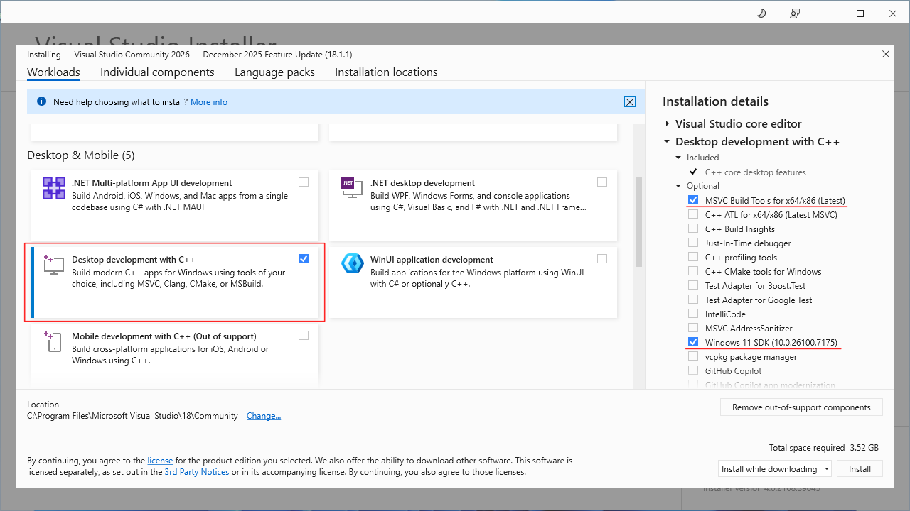

Then click “Install” and wait for the installation to complete. After that, you can close the installer.

If Visual Studio is already installed but the MSVC Build Tools for x64/x86 and Windows 11 SDK components are missing, then run: `setup.exe` (in C:\Program Files (x86)\Microsoft Visual Studio\Installer\setup.exe), and install the missing components.

> [!NOTE]
> If you are not going to use libraries written in C/C++ (and in this book we will not use them), these two components are sufficient. However, in the future you may also need:
> 
> * C++ CMake tools for Windows — the CMake utility used to build many C++ libraries
> * vcpkg package manager — a package manager for installing C/C++ libraries

3\) Now it is time to run the previously downloaded `rustup-init.exe`.
By default, the installer will offer to install the Rust toolchain for the target x86_64-pc-windows-msvc. This is the Windows build that uses the Visual C++ linker and C standard library.
In the console this should look like:

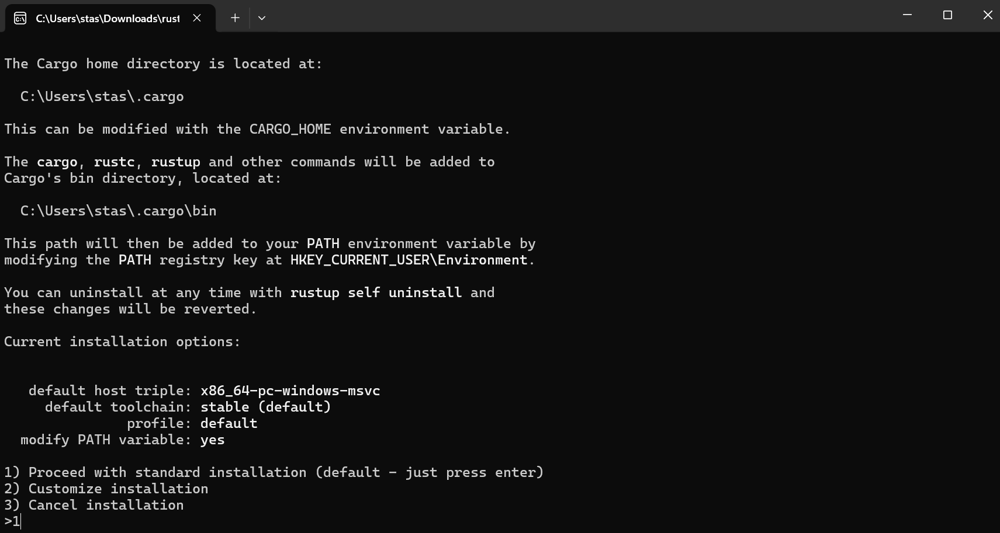

Choose option 1 (just install the  toolchain with default settings).

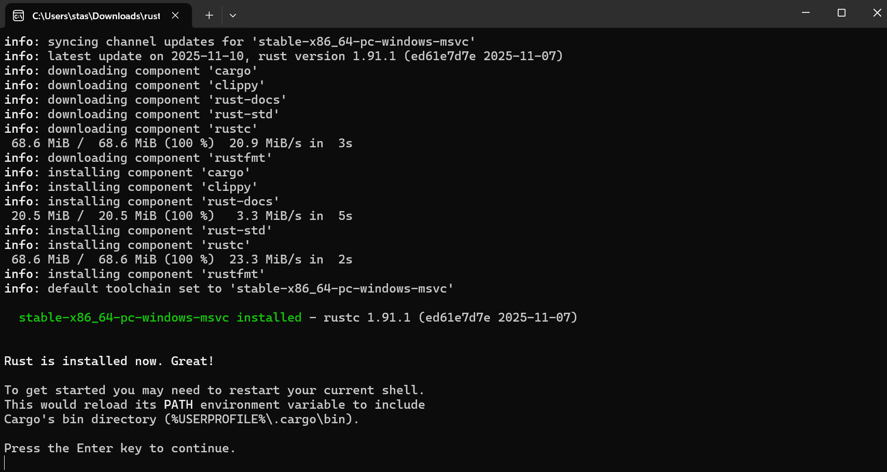

After the Rust toolchain installation is complete, you can close the console window. Everything necessary is now installed.

4\) Verify that the components were installed correctly.

Open a console (PowerShell or cmd) and run the following commands:

* `cargo new test_rust` — create a new Rust project. We will learn about Cargo later; for now, it is enough to know that this command creates a Rust program template that prints "Hello, world!" to the console.
* `cd test_rust` — navigate to the newly created directory.
* `cargo run` — compile and run the program.

In the console you should see:

All set.

***

## Установка с MinGW

[MinGW](https://www.mingw-w64.org/) — is a port of the GCC compiler for Windows. It includes its own linker and C standard library, so it can also be used to build Rust programs.

There are [several ways](https://www.mingw-w64.org/downloads/) to install MinGW. We will look at two of them:

* [MinGW-W64-builds](https://www.mingw-w64.org/downloads/#mingw-w64-builds) — just an archive containing utilities and libraries
* [MSYS2](https://www.msys2.org/) — an environment for creating a Linux-like development setup on Windows. It provides a package manager that can install MinGW and other tools.

***

### MinGW w64

The original MinGW-w64 build is distributed as an archive, which can be downloaded from the official GitHub page: [https://github.com/niXman/mingw-builds-binaries/releases](https://github.com/niXman/mingw-builds-binaries/releases).

On the download page you will find several build variants with names following this pattern:

`architecture-version-release-threading-exceptions-C_runtime-revision.7z`

For example:

* x86\_64-15.2.0-release-mcf-seh-ucrt-rt\_v13-rev0.7z
* x86\_64-15.2.0-release-posix-seh-msvcrt-rt\_v13-rev0.7z
* x86\_64-15.2.0-release-posix-seh-ucrt-rt\_v13-rev0.7z
* x86\_64-15.2.0-release-win32-seh-msvcrt-rt\_v13-rev0.7z
* x86\_64-15.2.0-release-win32-seh-ucrt-rt\_v13-rev0.7z

Any variant except `mcf` will work (at the time of writing, Rust 1.92 did not work with `mcf`). The author personally prefers the `win32-seh-ucrt-rt` variant.

1\) Download the 7z archive and extract it to a folder, for example: `C:\dev\mingw64`.

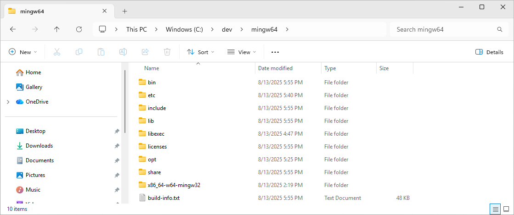

2\) Add the `mingw64\bin` directory to the system `Path` environment variable.

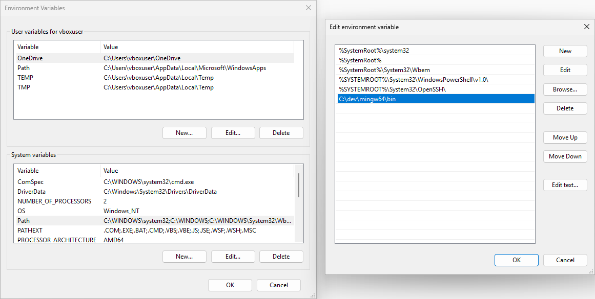

3\) Run `rustup-init.exe`.

When prompted for automatic installation, choose option 3 (do not install anything).

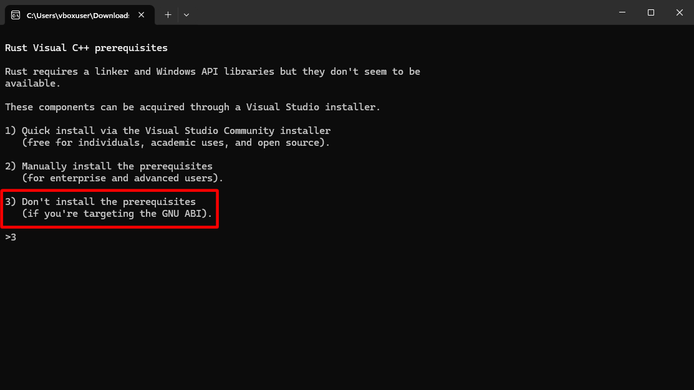

Rustup will then show the configuration it plans to install. By default, it will suggest `x86_64-pc-windows-msvc` (toolchain for Visual C++).

Choose option 2 (customize installation).

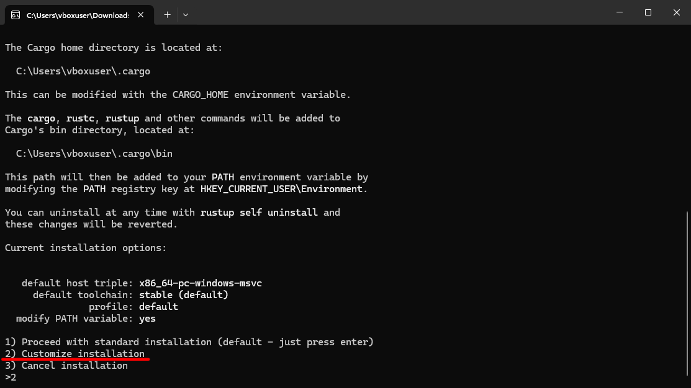

When asked for the toolchain name, instead of `x86_64-pc-windows-msvc`, enter `x86_64-pc-windows-gnu`.

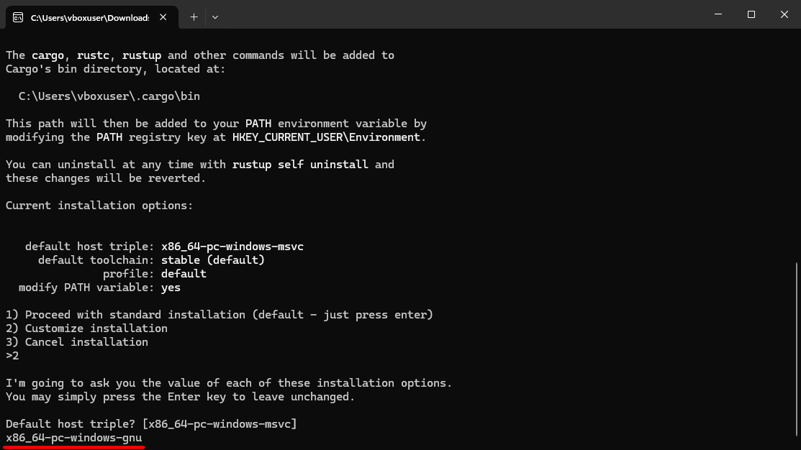

The default values are fine for the remaining parameters.

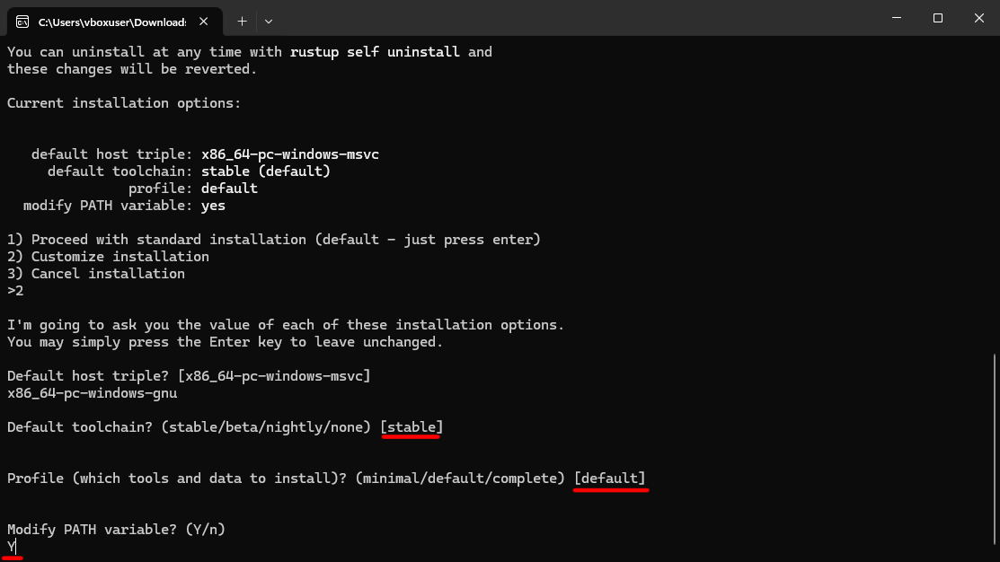

After installation completes, open a new console and test the setup the same way as before:

Откройте новую консоль и создайте и запустите Hello World программу, таким же образом, как и в описании установки вместе с Visual C++.

* `cargo new test_rust`
* `cd test_rust`
* `cargo run`

The result should look like:

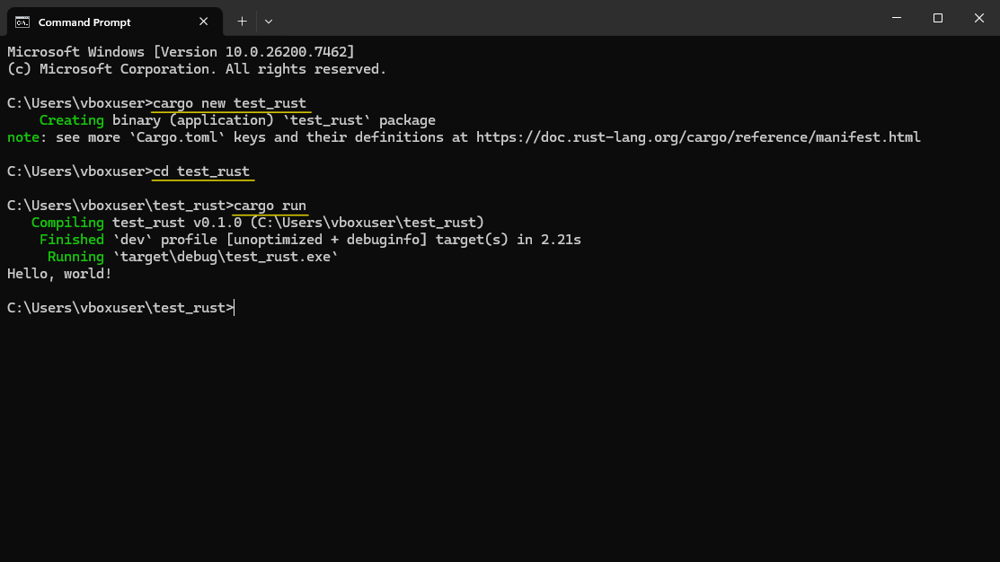

***

### MSYS2

In the previous MinGW-w64 scenario, we manually downloaded and configured MinGW. With [MSYS2](https://www.msys2.org/) the process is more automated. MSYS2 provides the `pacman` package manager, which can download and install programs and libraries from a remote repository. We will use it to install MinGW.

1\) Download the MSYS2 installer: [https://www.msys2.org/#installation](https://www.msys2.org/#installation)

Run the installer and choose the installation path (this is where MSYS2 and all installed packages will reside).

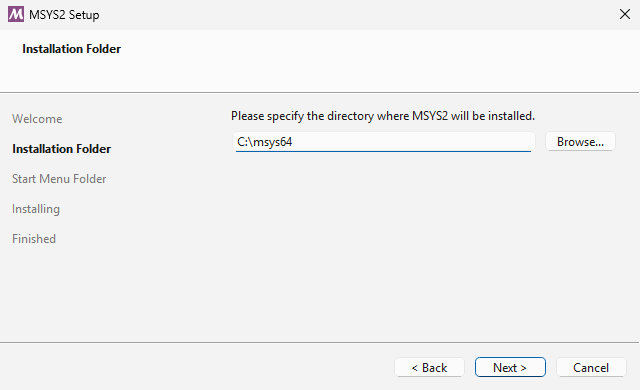

2\) After installation, open the MSYS2 console (available in the Start menu) and install the required packages `mingw` and `base-develop` using command:

`pacman -S mingw-w64-x86_64-toolchain`

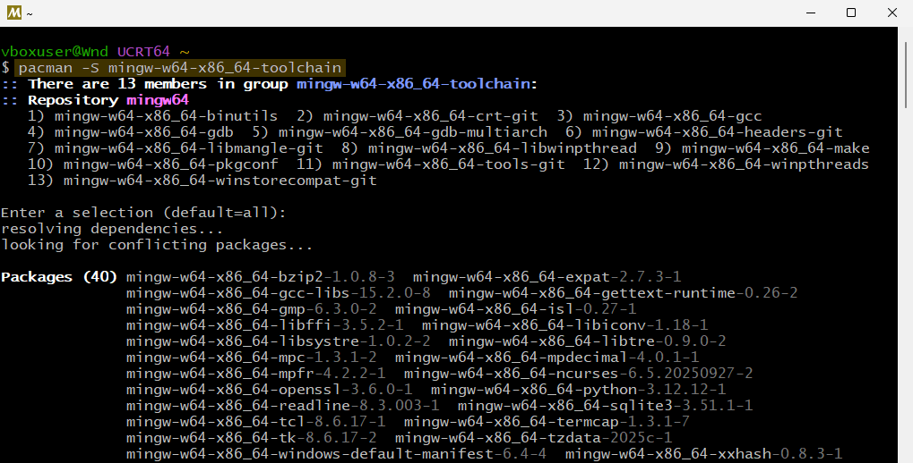

`pacman -S base-devel`

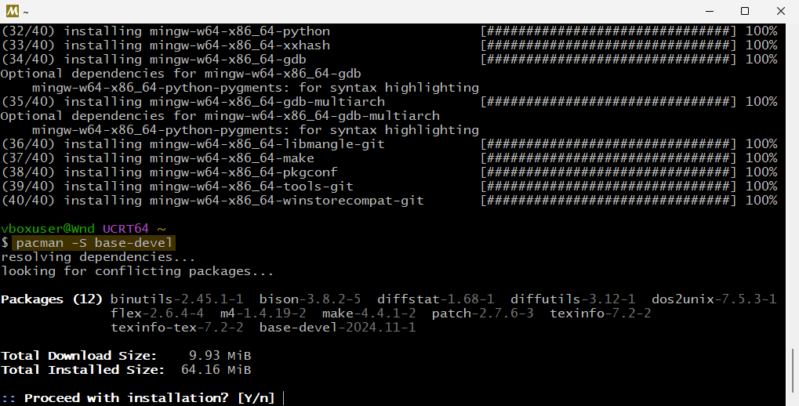

That’s it — MinGW is now installed and added to the system paths.

3\) Finally, install the Rust toolchain in the same way as described for the manual MinGW-w64 installation.

Run `rustup-init.exe`.

Then instead of `x86_64-pc-windows-msvc`, choose `x86_64-pc-windows-gnu` and complete the installation.

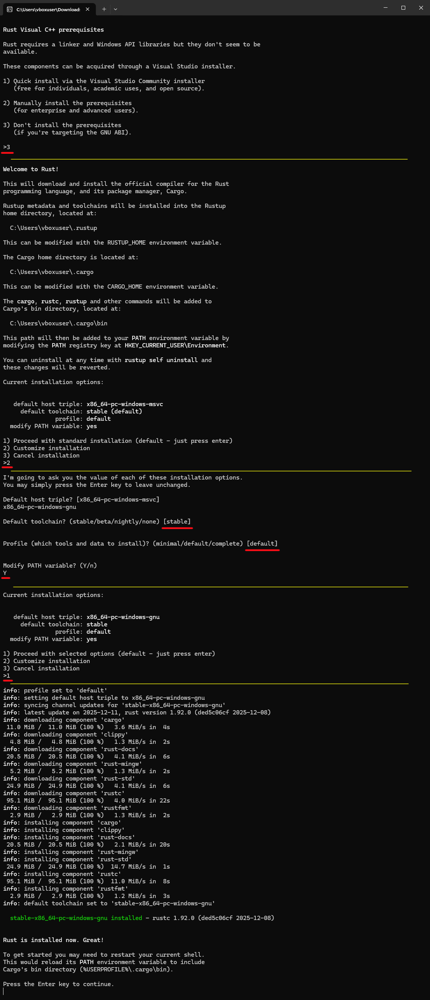

***

Rust is now installed. You can proceed to learning the language itself.

