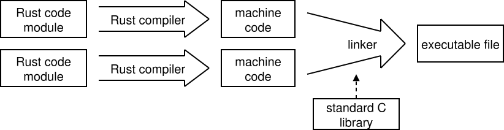

# Installing Rust

To work with Rust, you will need at minimum:

* The Rust toolchain (compiler, build system, etc.) for compiling Rust source code files into object files (files containing machine code)
* A linker for combining multiple object files into a final executable program
* The C standard library

The need for the C standard library arises from the fact that Rust uses C functions for memory allocation as well as for certain memory copy operations.

Building a Rust application roughly looks like this:

As you can see, when producing the final executable from compiled modules, the linker must have access to the C standard library.

***

The Rust toolchain can be installed using the official utility [rustup](https://www.rust-lang.org/tools/install). The linker and the C standard library can be installed in different ways depending on the operating system and the C++ toolchain.

In the following chapters, we will cover installing the Rust and C++ toolchains on Windows and Linux.
