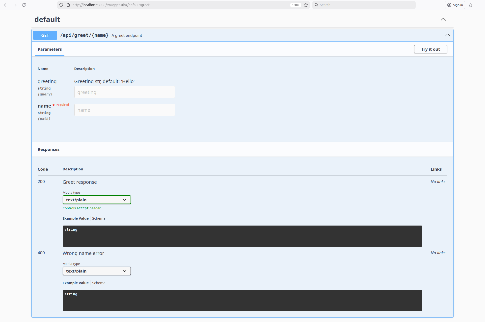
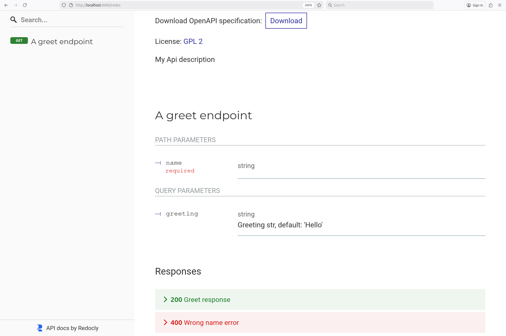
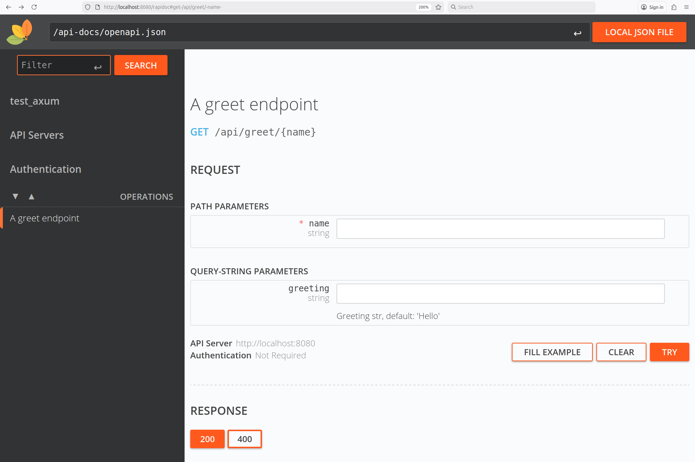
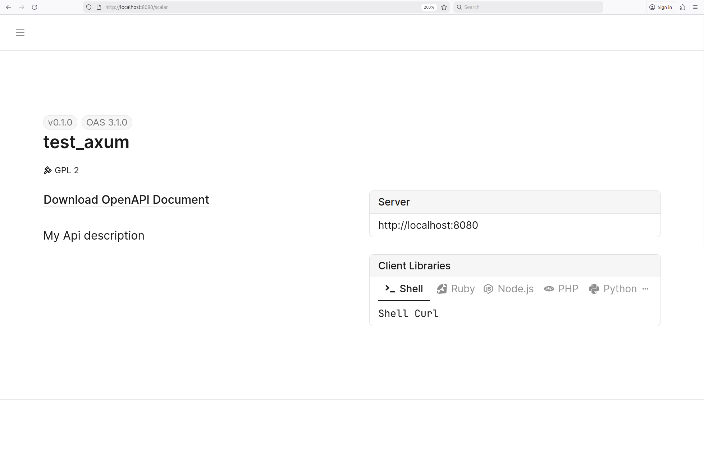
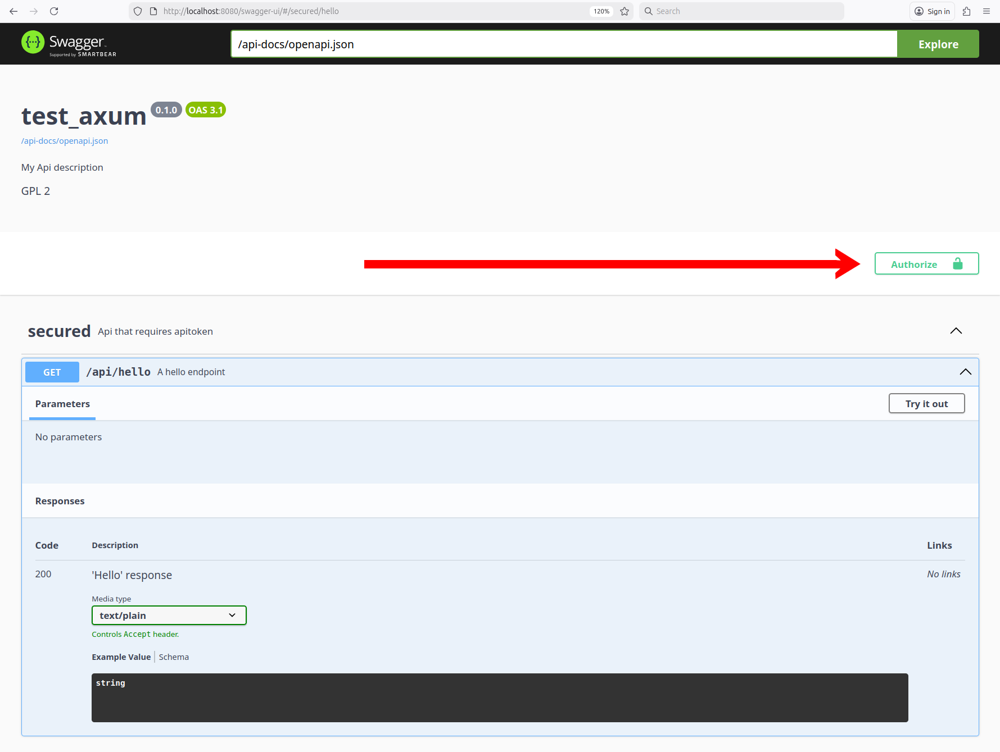

# Документирование API

Для бэкенд приложений с REST API хороший практикой считается предоставлять эндпоинт, который возвращает описание доступных эндпоинтов в формате [OpenAPI](https://swagger.io/specification/).

Open API описание позволяет не только понять, какие эндпоинты предоставляет бэкенд приложение, но и автоматически сгенерировать клиент для работы с этими эндпоинтами при помощи таких инструментов, как [Insomnia](https://insomnia.rest/) и [Postman](https://www.postman.com/).

В этой главе мы познакомимся с библиотекой [Utoipa](https://crates.io/crates/utoipa), которая предоставляет макросы для автоматической генерации Open API описания эндпоинтов.

## Структура OpenAPI

Сначала подключим Utoipa в `Cagro.toml`.

```toml
[package]
name = "test_axum"
version = "0.1.0"
edition = "2024"

[dependencies]
tokio = { version = "1", features = ["full"]}
axum = "0.8"
utoipa = { version = "5", features = ["axum_extras"] }
utoipa-axum = { version = "0.2" }
```

Теперь рассмотрим главный тип, отвечающий за представление OpenAPI схемы — структуру [utoipa::openapi::OpenApi](https://docs.rs/utoipa/latest/utoipa/openapi/struct.OpenApi.html).

```rust,noplayground
pub struct OpenApi {
    pub openapi: OpenApiVersion, // Версия OpenAPI спецификации
    pub info: Info, // Общая информация об API: версия, лицензия, автор
    pub servers: Option<Vec<Server>>,
    pub paths: Paths, // Описания эндпоинтов
    pub components: Option<Components>,
    pub security: Option<Vec<SecurityRequirement>>, // детали аутентификации
    pub tags: Option<Vec<Tag>>,
    pub external_docs: Option<ExternalDocs>,
    pub schema: String,
    pub extensions: Option<Extensions>,
}
```

Именно объект `OpenApi` используется для того, чтобы составить Open API схему эндпоинтов, а после отдать её в  виде JSON документа.

Обычно объект `OpenApi` генерируется из описания эндпоинтов, однако чтобы лучше понять его устройство, давай создадим объект `OpenApi` вручную.

```rust,noplayground
use utoipa::openapi::{
  Content, HttpMethod, Info, License, OpenApiBuilder,
  PathItem, Paths, Response, path::Operation
};

fn main() {
  let open_api = OpenApiBuilder::new()
    .info(
      Info::builder()
        .license(Some(License::new("GPL 2")))
        .title("This is my API")
        .version("1.0")
    )
    .paths(
      Paths::builder()
        .path("/hello", 
          PathItem::builder()
            .summary(Some("My Hello endpoint"))
            .operation(HttpMethod::Get,
              Operation::builder()
                .response("200",
                  Response::builder()
                    .description("'Hello' string")
                    .content("text/plain", Content::builder().build()))
                    .build()
            )
            .build()
        )
    )
    .build();
  println!("{}", open_api.to_pretty_json().unwrap());
}
```

Вывод программы:

```json
{
  "openapi": "3.1.0",
  "info": {
    "title": "This is my API",
    "license": { "name": "GPL 2" },
    "version": "1.0"
  },
  "paths": {
    "/hello": {
      "summary": "My Hello endpoint",
      "get": {
        "responses": {
          "200": { "description": "'Hello' string", "content": { "text/plain": {} } }
        }
      }
    }
  }
}
```

Как видите, структура `OpenApi` является ничем иным, как просто Rust представлением Open API спецификации.

Для получения JSON документа из объекта `OpenApi` используются методы [to_json](https://docs.rs/utoipa/latest/utoipa/openapi/struct.OpenApi.html#method.to_json) или [to_pretty_json](https://docs.rs/utoipa/latest/utoipa/openapi/struct.OpenApi.html#method.to_pretty_json): первый возвращает JSON документ одной строкой, а второй предоставляет JSON отформатированным для удобного чтения человеком.

## Генерация схемы

Теперь, когда мы познакомились со структурой `OpenApi`, давайте разберёмся, как её автоматически генерировать из функций-обработчиков.

Для того чтобы Utoipa могла сгенерировать Open API описание из функции-обработчика запросов, эту функцию необходимо пометить аннотацией [path](https://docs.rs/utoipa/latest/utoipa/attr.path.html), при этом указав HTTP метод, URL путь, варианты ответа и т.д.

Для примера давайте перепишем наш традиционный Axum Hello пример, добавив к серверу эндпоинт, который отдаёт Open API схему.

```rust,noplayground
use axum::routing::get;
use utoipa::OpenApi;
use utoipa_axum::{router::OpenApiRouter, routes};

#[derive(OpenApi)]
#[openapi(info(description = "My Api description", license(name = "GPL 2")))]
struct MyApiDoc;

// Эта аннотация используется и для генерации OpenAPI документации эндпоинта,
// и для создания Axum роутера, что позволяет не повторять одни и те же настройки.
#[utoipa::path(
    get,             // Эндпоинт вызывается для HTTP GET метода
    path = "/hello", // URL путь эндпоинат
    responses(       // Возможные варианты ответа от эндпоинта
        (status = 200, description = "'Hello' response", body = &'static str)
    ),
    summary = "A hello endpoint", // Текстовое описание эндпоинта
)]
async fn hello() -> &'static str {
    "Hello"
}

#[tokio::main]
async fn main() {
    // Создаём Open API роутер, который содержит и информацию о роутинге,
    // и Open API описание эндпоинтов
    let open_api = OpenApiRouter::with_openapi(MyApiDoc::openapi())
        .nest("/api",            // создаём эндпоинты из utoipa аннотации
            OpenApiRouter::new() // и помещаем их под путь /api/
                .routes(routes!(hello))
        );

    // Получаем отдельно Axum роутер и OpenAPI описание эндпоинтов
    let (router, api) = open_api.split_for_parts();

    // К роутеру, сгенерированному из OpenAPI роутера, добавляем
    // эндпоинт, отдающий JSON Open API схему эндпоинтов
    let app = router
        .route("/api-doc", get(async move || { api.to_pretty_json().unwrap() }));

    let listener = tokio::net::TcpListener::bind("0.0.0.0:8080").await.unwrap();
    axum::serve(listener, app).await.unwrap();
}
```

Теперь, если мы запустим сервер и перейдём на [http://localhost:8080/api-doc](http://localhost:8080/api-doc), то должны получить примерно следующий JSON документ:

```json
{
  "openapi": "3.1.0",
  "info": {
    "title": "test_axum",
    "description": "My Api description",
    "license": { "name": "GPL 2" },
    "version": "0.1.0"
  },
  "paths": {
    "/api/hello": {
      "get": {
        "summary": "A hello endpoint",
        "operationId": "hello",
        "responses": {
          "200": {
            "description": "'Hello' response",
            "content": { "text/plain": { "schema": { "type": "string" } } }
          }
        }
      }
    }
  },
  "components": {}
}
```

Как видите, мы используем аннотацию `path` и для создания Open API описания эндпоинта, и для регистрации эндпоинта в Axum роутере: HTTP метод и URL путь берутся из `path` аннотации.

```rust,noplayground
let open_api = OpenApiRouter::with_openapi(MyApiDoc::openapi())
.nest("/api",
    OpenApiRouter::new()
        .routes(routes!(hello)) // мы не указываем путь и HTTP метод явно
);
```

Так было сделано, чтобы не дублировать конфигурацию отдельно в аннотации `path`, и отдельно в роутере.

## Более сложный эндпоинт

Рассмотрим теперь более сложный эндпоинт, который принимает аргументы пути, квери-аргументы, а также имеет несколько вариантов формата ответа.

```rust,noplayground
use std::collections::HashMap;

use axum::{extract::{Path, Query}, http::StatusCode, routing::get};
use utoipa::OpenApi;
use utoipa_axum::{router::OpenApiRouter, routes};

#[derive(OpenApi)]
#[openapi(info(description = "My Api description", license(name = "GPL 2")))]
struct MyApiDoc;

#[utoipa::path(
    get,
    path = "/greet/{name}",
    params(
        ("greeting" = Option<String>, Query, description = "Greeting str, default: 'Hello'"),
    ),
    responses(
        (status = 200, description = "Greet response", body = String),
        (status = 400, description = "Wrong name error", body = String)
    ),
    summary = "A greet endpoint",
)]
async fn greet(
    Path(name): Path<String>,
    Query(map): Query<HashMap<String, String>>
) -> (StatusCode, String) {
    // Имя не должно быть короче двух символов.
    if name.len() < 2 {
        return (StatusCode::BAD_REQUEST, "Wrong name".to_string());
    }
    let greeting = map.get("greeting")
        .map(|s| s.as_str())
        .unwrap_or("Hello");
    (StatusCode::OK, format!("{greeting}, {name}!"))
}

#[tokio::main]
async fn main() {
    let open_api = OpenApiRouter::with_openapi(MyApiDoc::openapi())
        .nest("/api", OpenApiRouter::new().routes(routes!(greet)));
    let (router, api) = open_api.split_for_parts();
    let app = router
        .route("/api-doc", get(async move || { api.to_pretty_json().unwrap() }));
    let listener = tokio::net::TcpListener::bind("0.0.0.0:8080").await.unwrap();
    axum::serve(listener, app).await.unwrap();
}
```

Open API описание для этого эндпоинта ([http://localhost:8080/api-doc](http://localhost:8080/api-doc)) выглядит так:

```json
{
  "openapi": "3.1.0",
  "info": {
    "title": "test_axum",
    "description": "My Api description",
    "license": { "name": "GPL 2" },
    "version": "0.1.0"
  },
  "paths": {
    "/api/greet/{name}": {
      "get": {
        "summary": "A greet endpoint",
        "operationId": "greet",
        "parameters": [
          {
            "name": "greeting",
            "in": "query",
            "description": "Greeting str, default: 'Hello'",
            "required": false,
            "schema": { "type": "string" }
          },
          {
            "name": "name",
            "in": "path",
            "required": true,
            "schema": { "type": "string" }
          }
        ],
        "responses": {
          "200": {
            "description": "Greet response",
            "content": { "text/plain": { "schema": { "type": "string" } } }
          },
          "400": {
            "description": "Wrong name error",
            "content": { "text/plain": { "schema": { "type": "string" } } }
          }
        }
      }
    }
  },
  "components": {}
}
```

Больше примеров использования аннотации `path` можно найти в официальной документации: [https://docs.rs/utoipa/latest/utoipa/attr.path.html](https://docs.rs/utoipa/latest/utoipa/attr.path.html).

## Swagger UI и аналоги

Очень часто в паре с Open API описанием эндпоинтов бэкенд-приложения предоставляют и web-инструмент для вызова и тестирования этих эндпоинтов. Экосистема Utoipa предоставляет крэйты для интеграции со следующими web-инструментами:

* [Swagger UI](https://swagger.io/tools/swagger-ui/)
* [Redoc](https://redocly.com/)
* [RapiDoc](https://rapidocweb.com/)
* [Scalar](https://scalar.com/)

Принцип работы с ними очень простой:

1. Мы подключаем соответствующую библиотеку.
2. Генерируем Open API описание эндпоинтов при помощи Utoipa.
3. Крэйт Utoipa SwaggerUI (или Redoc/RapiDoc/Scalar) предоставляет специальный сервис (Tower сервис), который мы просто подключаем в роутер.
4. При переходе на URL, по которому SwaggerUI (или другой инструмент) эндпоинт зарегистрирован в роутере, подгружается веб страница со SwaggerUI, которая по Open API описанию создаёт клиент, позволяющий делать вызовы API прямо с веб страницы.

***

Для начала нам нужно подключить соответствующие крэйты:

```toml
[package]
name = "test_axum"
version = "0.1.0"
edition = "2024"

[dependencies]
tokio = { version = "1", features = ["full"]}
axum = "0.8"
utoipa = { version = "5", features = ["axum_extras"] }
utoipa-axum = { version = "0.2" }
utoipa-swagger-ui = { version = "9", features = ["axum"] }
utoipa-redoc = { version = "6", features = ["axum"] }
utoipa-rapidoc = { version = "6", features = ["axum"] }
utoipa-scalar = { version = "0.3", features = ["axum"] }
```

Теперь мы можем добавить SwaggerUI, Redoc, RapiDoc и Scalar в роутере. Вы, скорее всего, будете пользоваться только одним из них, но в учебных целях мы подключим все.

```rust,noplayground
use std::collections::HashMap;
use axum::{extract::{Path, Query}, http::StatusCode};
use utoipa::OpenApi;
use utoipa_axum::{router::OpenApiRouter, routes};
use utoipa_rapidoc::RapiDoc;
use utoipa_redoc::{Redoc, Servable};
use utoipa_scalar::{Scalar, Servable as ScalarServable};
use utoipa_swagger_ui::SwaggerUi;

#[derive(OpenApi)]
#[openapi(info(description = "My Api description", license(name = "GPL 2")))]
struct MyApiDoc;

#[utoipa::path(
    get,
    path = "/greet/{name}",
    params(
        ("greeting" = Option<String>, Query, description = "Greeting str, default: 'Hello'"),
    ),
    responses(
        (status = 200, description = "Greet response", body = String),
        (status = 400, description = "Wrong name error", body = String)
    ),
    summary = "A greet endpoint",
)]
async fn greet(
    Path(name): Path<String>,
    Query(map): Query<HashMap<String, String>>
) -> (StatusCode, String) {
    if name.len() < 2 {
        return (StatusCode::BAD_REQUEST, "Wrong name".to_string());
    }
    let greeting = map.get("greeting")
        .map(|s| s.as_str())
        .unwrap_or("Hello");
    (StatusCode::OK, format!("{greeting}, {name}!"))
}

#[tokio::main]
async fn main() {
    let open_api = OpenApiRouter::with_openapi(MyApiDoc::openapi())
        .nest("/api", OpenApiRouter::new().routes(routes!(greet)));
    let (router, api) = open_api.split_for_parts();

    let app = router
        .merge(SwaggerUi::new("/swagger-ui").url("/api-docs/openapi.json", api.clone()))
        .merge(Redoc::with_url("/redoc", api.clone()))
        .merge(RapiDoc::new("/api-docs/openapi.json").path("/rapidoc"))
        .merge(Scalar::with_url("/scalar", api));

    let listener = tokio::net::TcpListener::bind("0.0.0.0:8080").await.unwrap();
    axum::serve(listener, app).await.unwrap();
}
```

Теперь мы можем запустить сервер и открыть:

* SwaggerUI: [http://localhost:8080/swagger-ui/](http://localhost:8080/swagger-ui/)



* Redoc: [http://localhost:8080/redoc](http://localhost:8080/redoc)



* RapiDoc: [http://localhost:8080/rapidoc](http://localhost:8080/rapidoc)



* Scalar: [http://localhost:8080/scalar](http://localhost:8080/scalar)



## Аутентификация

Если для вызова эндпоинта необходимо передать некий аутентификационный токен (через HTTP заголовок, квери параметр или cookie), то это также должно быть отражено в Open API описании эндпоинтов. Во-первых, потому что эта информация необходима пользователям API, а во-вторых, потому что Swagger UI и другие подобные инструменты иначе не смогут корректно построить клиент для эндпоинтов.

Давайте рассмотрим пример, когда эндпоинты ожидают передачу токена через HTTP заголовок с именем "x-key". В рамках примера нам не важен механизм получения этого токена. Также для простоты мы не будем валидировать токен, а будем просто считать, что все токены валидны.

```rust,noplayground
use axum::{extract::{FromRequestParts}, http::StatusCode};
use utoipa::{Modify, OpenApi, openapi::security::{ApiKey, ApiKeyValue, SecurityScheme}};
use utoipa_axum::{router::OpenApiRouter, routes};
use utoipa_rapidoc::RapiDoc;
use utoipa_redoc::{Redoc, Servable};
use utoipa_scalar::{Scalar, Servable as ScalarServable};
use utoipa_swagger_ui::SwaggerUi;

// Имя HTTP заголовка для передачи токена
const APIKEY_HEADER: &str = "x-key";

// Тип, который мы будем использовать для добавления информации 
// об аутентификации в документ OpenAPI
struct MySecurityAddon;

// Модифицируем OpenAPI документ путём добавления компонента - SecurityScheme,
// который указывает, какой токен необходим для аутентификации и как он передаётся.
impl Modify for MySecurityAddon {
    fn modify(&self, openapi: &mut utoipa::openapi::OpenApi) {
        if let Some(components) = openapi.components.as_mut() {
            components.add_security_scheme(
                "apikey_auth",
                SecurityScheme::ApiKey(ApiKey::Header(ApiKeyValue::new(APIKEY_HEADER))),
            )
        }
    }
}

#[derive(OpenApi)]
#[openapi(
    info(description = "My Api description", license(name = "GPL 2")),
    modifiers(&MySecurityAddon), // Добавляем наш SecurityAddon
)]
struct MyApiDoc;

#[utoipa::path(
    get,
    path = "/hello",
    responses((status = 200, description = "'Hello' response", body = &'static str)),
    summary = "A hello endpoint",
    security( ("apikey_auth" = []) )
)]
async fn hello(_session: Authenticated) -> &'static str {
    "Hello"
}

// Обычный Axum экстрактор, который для любого запроса, у которого есть HTTP заголовок
// x-key, возвращает объект Authenticated, сигнализирующий что клиент - авторизован
struct Authenticated;
impl<S: Send + Sync> FromRequestParts<S> for Authenticated {
    type Rejection = StatusCode;

    async fn from_request_parts(
        parts: &mut axum::http::request::Parts,
        _state: &S,
    ) -> Result<Self, Self::Rejection> {
        if let Some(_session_id) = parts.headers.get(APIKEY_HEADER) {
            Ok(Authenticated)
        } else {
            Err(StatusCode::UNAUTHORIZED)
        }
    }
}

#[tokio::main]
async fn main() {
    let open_api = OpenApiRouter::with_openapi(MyApiDoc::openapi())
        .nest("/api", OpenApiRouter::new().routes(routes!(hello)));

    let (router, api) = open_api.split_for_parts();

    let app = router
        .merge(SwaggerUi::new("/swagger-ui").url("/api-docs/openapi.json", api.clone()))
        .merge(Redoc::with_url("/redoc", api.clone()))
        .merge(RapiDoc::new("/api-docs/openapi.json").path("/rapidoc"))
        .merge(Scalar::with_url("/scalar", api));

    let listener = tokio::net::TcpListener::bind("0.0.0.0:8080").await.unwrap();
    axum::serve(listener, app).await.unwrap();
}
```

Если мы запустим сервер и запросим Open API описание эндпоинтов ([http://localhost:8080/api-docs/openapi.json](http://localhost:8080/api-docs/openapi.json)), то увидим, что в документе появился компонент, описывающий нашу аутентификацию.

```json
{
   "openapi":"3.1.0",
   "info":{
      "title":"test_axum",
      "description":"My Api description",
      "license":{ "name":"GPL 2" },
      "version":"0.1.0"
   },
   "paths":{
      "/api/hello":{
         "get":{
            "summary":"A hello endpoint",
            "operationId":"hello",
            "responses":{
               "200":{
                  "description":"'Hello' response",
                  "content":{ "text/plain":{ "schema":{ "type":"string" } } }
               }
            },
            "security":[ { "apikey_auth":[] } ]
         }
      }
   },
   "components":{
      "securitySchemes":{ "apikey_auth":{ "type":"apiKey", "in":"header", "name":"x-key" }}
   }
}
```

Если мы запустим Swagger UI ([http://localhost:8080/swagger-ui/](http://localhost:8080/swagger-ui/)), то увидим, что в нём появилась кнопка "Authenticate", которая позволит ввести "x-key", после чего мы сможем использовать эндпоинты, требующие аутентификацию.



