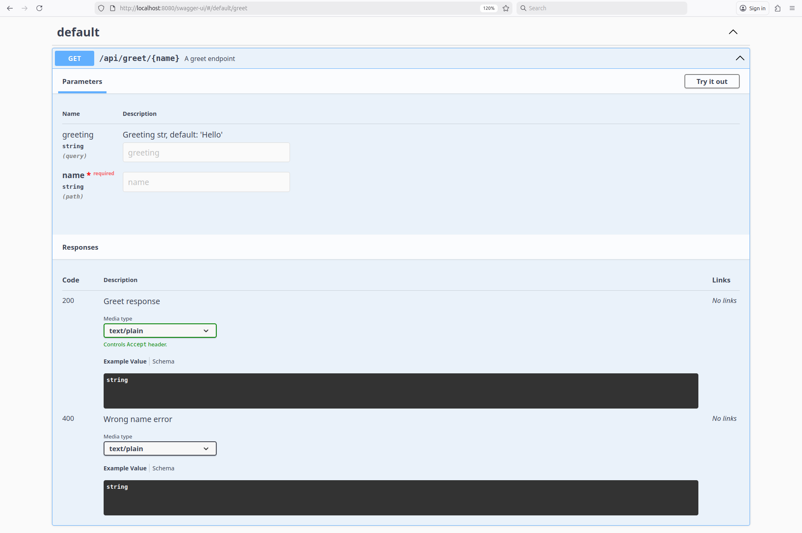
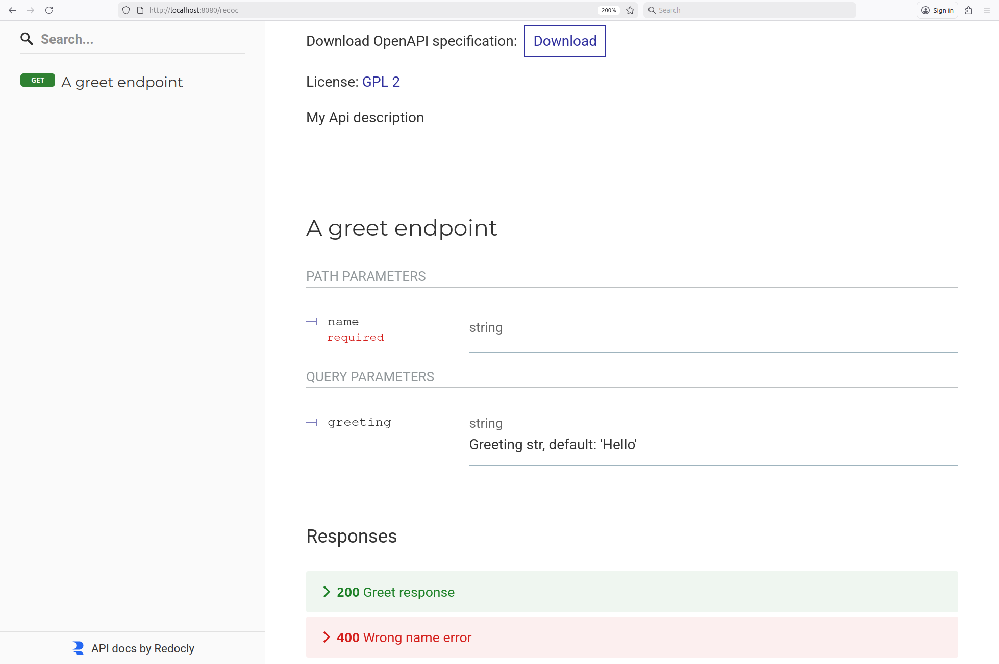
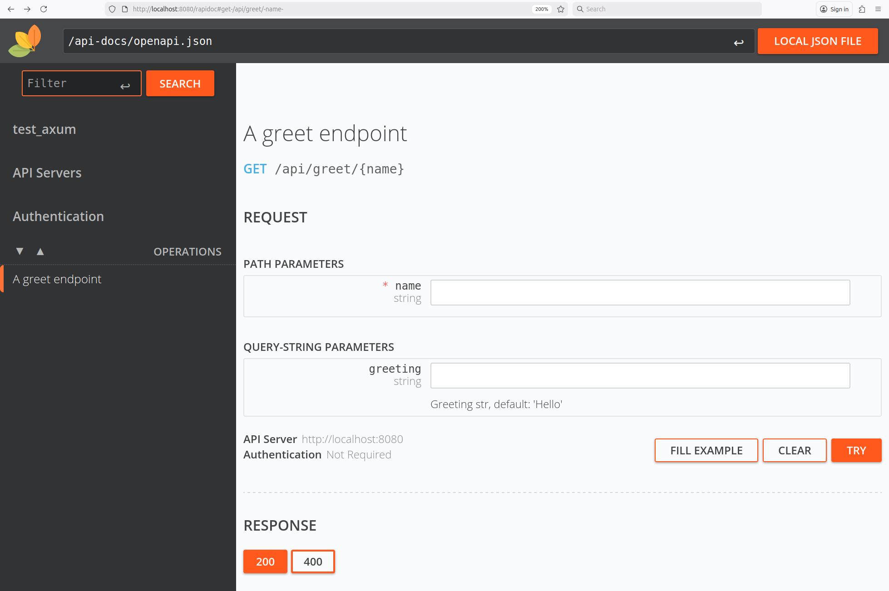
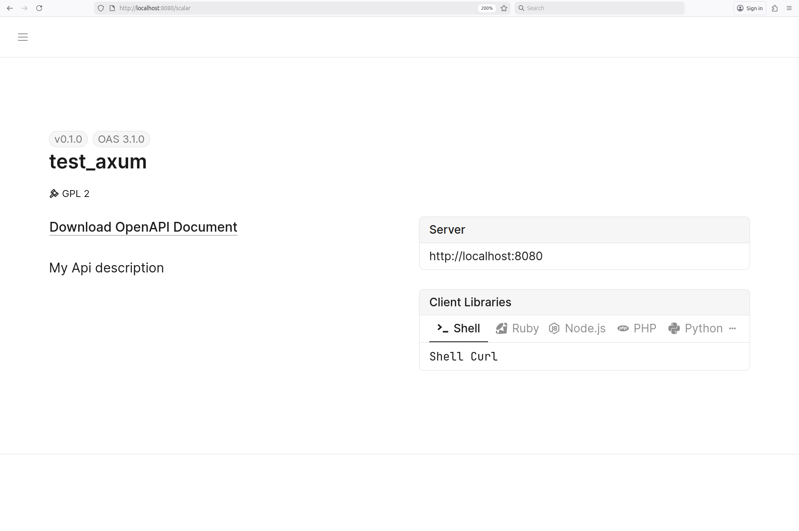
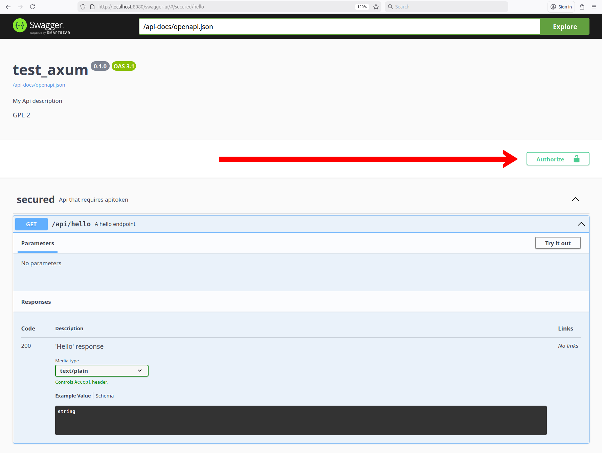

# Documenting API

For backend applications with a REST API, it is considered good practice to provide an endpoint that returns a description of available endpoints in the [OpenAPI](https://swagger.io/specification/) format.

An OpenAPI description allows you not only to understand which endpoints the backend application provides but also to automatically generate a client for working with these endpoints using tools such as [Insomnia](https://insomnia.rest/) and [Postman](https://www.postman.com/).

In this chapter, we will get acquainted with the [Utoipa](https://crates.io/crates/utoipa) library, which provides macros for the automatic generation of OpenAPI endpoint descriptions.

## OpenAPI Structure

First, let's add Utoipa to `Cagro.toml`.

```toml
[package]
name = "test_axum"
version = "0.1.0"
edition = "2024"

[dependencies]
tokio = { version = "1", features = ["full"]}
axum = "0.8"
utoipa = { version = "5", features = ["axum_extras"] }
utoipa-axum = { version = "0.2" }
```

Now let's look at the main type responsible for representing the OpenAPI schema — the [utoipa::openapi::OpenApi](https://docs.rs/utoipa/latest/utoipa/openapi/struct.OpenApi.html) struct.

```rust,noplayground
pub struct OpenApi {
    pub openapi: OpenApiVersion, // OpenAPI specification version
    pub info: Info, // General API information: version, license, author
    pub servers: Option<Vec<Server>>,
    pub paths: Paths, // Endpoint descriptions
    pub components: Option<Components>,
    pub security: Option<Vec<SecurityRequirement>>, // authentication details
    pub tags: Option<Vec<Tag>>,
    pub external_docs: Option<ExternalDocs>,
    pub schema: String,
    pub extensions: Option<Extensions>,
}
```

The `OpenApi` object is precisely what is used to compose the OpenAPI schema of endpoints and then serve it as a JSON document.

Usually, the `OpenApi` object is generated from endpoint descriptions; however, to better understand its structure, let's create an `OpenApi` object manually.

```rust,noplayground
use utoipa::openapi::{
  Content, HttpMethod, Info, License, OpenApiBuilder,
  PathItem, Paths, Response, path::Operation
};

fn main() {
  let open_api = OpenApiBuilder::new()
    .info(
      Info::builder()
        .license(Some(License::new("GPL 2")))
        .title("This is my API")
        .version("1.0")
    )
    .paths(
      Paths::builder()
        .path("/hello", 
          PathItem::builder()
            .summary(Some("My Hello endpoint"))
            .operation(HttpMethod::Get,
              Operation::builder()
                .response("200",
                  Response::builder()
                    .description("'Hello' string")
                    .content("text/plain", Content::builder().build()))
                    .build()
            )
            .build()
        )
    )
    .build();
  println!("{}", open_api.to_pretty_json().unwrap());
}
```

Program output:

```json
{
  "openapi": "3.1.0",
  "info": {
    "title": "This is my API",
    "license": { "name": "GPL 2" },
    "version": "1.0"
  },
  "paths": {
    "/hello": {
      "summary": "My Hello endpoint",
      "get": {
        "responses": {
          "200": { "description": "'Hello' string", "content": { "text/plain": {} } }
        }
      }
    }
  }
}
```

As you can see, the `OpenApi` struct is nothing more than a Rust representation of the OpenAPI specification.

To obtain a JSON document from an `OpenApi` object, the [to_json](https://docs.rs/utoipa/latest/utoipa/openapi/struct.OpenApi.html#method.to_json) or [to_pretty_json](https://docs.rs/utoipa/latest/utoipa/openapi/struct.OpenApi.html#method.to_pretty_json) methods are used: the former returns a JSON document as a single line, while the latter provides the JSON formatted for easy human reading.

## Schema Generation

Now that we have familiarized ourselves with the `OpenApi` structure, let's explore how to automatically generate it from handler functions.

For Utoipa to generate an OpenAPI description from a request handler, you must mark the function with the [path](https://docs.rs/utoipa/latest/utoipa/attr.path.html) attribute, specifying the HTTP method, URL path, response variants, and other relevant metadata.

As an example, let's rewrite our traditional Axum "Hello" example by adding an endpoint to the server that serves the OpenAPI schema.

```rust,noplayground
use axum::routing::get;
use utoipa::OpenApi;
use utoipa_axum::{router::OpenApiRouter, routes};

#[derive(OpenApi)]
#[openapi(info(description = "My Api description", license(name = "GPL 2")))]
struct MyApiDoc;

// This attribute is used both for generating OpenAPI endpoint documentation
// and for creating the Axum router, which prevents duplicating the same settings.
#[utoipa::path(
    get,             // The endpoint is called via the HTTP GET method
    path = "/hello", // The endpoint's URL path
    responses(       // Possible response variants from the endpoint
        (status = 200, description = "'Hello' response", body = &'static str)
    ),
    summary = "A hello endpoint", // A text description of the endpoint
)]
async fn hello() -> &'static str {
    "Hello"
}

#[tokio::main]
async fn main() {
    // Create an OpenAPI router that contains both routing information 
    // and the OpenAPI descriptions of the endpoints
    let open_api = OpenApiRouter::with_openapi(MyApiDoc::openapi())
        .nest("/api",            // create endpoints from the utoipa attribute
            OpenApiRouter::new() // and place them under the /api/ path
                .routes(routes!(hello))
        );

    // Extract the Axum router and the OpenAPI description separately
    let (router, api) = open_api.split_for_parts();

    // To the router generated from the OpenAPI router, we add
    // an endpoint that serves the JSON OpenAPI schema
    let app = router
        .route("/api-doc", get(async move || { api.to_pretty_json().unwrap() }));

    let listener = tokio::net::TcpListener::bind("0.0.0.0:8080").await.unwrap();
    axum::serve(listener, app).await.unwrap();
}
```

Now, if we run the server and navigate to [http://localhost:8080/api-doc](http://localhost:8080/api-doc), we should receive a JSON document similar to this:

```json
{
  "openapi": "3.1.0",
  "info": {
    "title": "test_axum",
    "description": "My Api description",
    "license": { "name": "GPL 2" },
    "version": "0.1.0"
  },
  "paths": {
    "/api/hello": {
      "get": {
        "summary": "A hello endpoint",
        "operationId": "hello",
        "responses": {
          "200": {
            "description": "'Hello' response",
            "content": { "text/plain": { "schema": { "type": "string" } } }
          }
        }
      }
    }
  },
  "components": {}
}
```

As you can see, we use the `path` attribute both to create the OpenAPI description and to register the endpoint in the Axum router: the HTTP method and URL path are extracted directly from the attribute.

```rust,noplayground
let open_api = OpenApiRouter::with_openapi(MyApiDoc::openapi())
.nest("/api",
    OpenApiRouter::new()
        .routes(routes!(hello)) // we don't specify the path and method explicitly here
);
```

This design ensures that configuration isn't duplicated between the path attribute and the router setup.

## A More Complex Endpoint

Now, let's look at a more complex endpoint that accepts path parameters, query parameters, and supports multiple response variants.

```rust,noplayground
use std::collections::HashMap;

use axum::{extract::{Path, Query}, http::StatusCode, routing::get};
use utoipa::OpenApi;
use utoipa_axum::{router::OpenApiRouter, routes};

#[derive(OpenApi)]
#[openapi(info(description = "My Api description", license(name = "GPL 2")))]
struct MyApiDoc;

#[utoipa::path(
    get,
    path = "/greet/{name}",
    params(
        ("greeting" = Option<String>, Query, description = "Greeting str, default: 'Hello'"),
    ),
    responses(
        (status = 200, description = "Greet response", body = String),
        (status = 400, description = "Wrong name error", body = String)
    ),
    summary = "A greet endpoint",
)]
async fn greet(
    Path(name): Path<String>,
    Query(map): Query<HashMap<String, String>>
) -> (StatusCode, String) {
    // Name must be at least two characters long.
    if name.len() < 2 {
        return (StatusCode::BAD_REQUEST, "Wrong name".to_string());
    }
    let greeting = map.get("greeting")
        .map(|s| s.as_str())
        .unwrap_or("Hello");
    (StatusCode::OK, format!("{greeting}, {name}!"))
}

#[tokio::main]
async fn main() {
    let open_api = OpenApiRouter::with_openapi(MyApiDoc::openapi())
        .nest("/api", OpenApiRouter::new().routes(routes!(greet)));
    let (router, api) = open_api.split_for_parts();
    let app = router
        .route("/api-doc", get(async move || { api.to_pretty_json().unwrap() }));
    let listener = tokio::net::TcpListener::bind("0.0.0.0:8080").await.unwrap();
    axum::serve(listener, app).await.unwrap();
}
```

The OpenAPI description for this endpoint ([http://localhost:8080/api-doc](http://localhost:8080/api-doc)) looks like this:

```json
{
  "openapi": "3.1.0",
  "info": {
    "title": "test_axum",
    "description": "My Api description",
    "license": { "name": "GPL 2" },
    "version": "0.1.0"
  },
  "paths": {
    "/api/greet/{name}": {
      "get": {
        "summary": "A greet endpoint",
        "operationId": "greet",
        "parameters": [
          {
            "name": "greeting",
            "in": "query",
            "description": "Greeting str, default: 'Hello'",
            "required": false,
            "schema": { "type": "string" }
          },
          {
            "name": "name",
            "in": "path",
            "required": true,
            "schema": { "type": "string" }
          }
        ],
        "responses": {
          "200": {
            "description": "Greet response",
            "content": { "text/plain": { "schema": { "type": "string" } } }
          },
          "400": {
            "description": "Wrong name error",
            "content": { "text/plain": { "schema": { "type": "string" } } }
          }
        }
      }
    }
  },
  "components": {}
}
```

More examples of using the `path` attribute can be found in the official documentation: [https://docs.rs/utoipa/latest/utoipa/attr.path.html](https://docs.rs/utoipa/latest/utoipa/attr.path.html).

## Swagger UI and Alternatives

It is quite common for backend applications to provide a web-based tool alongside their OpenAPI endpoint descriptions to allow for easy testing and debugging. The Utoipa ecosystem provides dedicated crates for integrating with several popular web tools:

* [Swagger UI](https://swagger.io/tools/swagger-ui/)
* [Redoc](https://redocly.com/)
* [RapiDoc](https://rapidocweb.com/)
* [Scalar](https://scalar.com/)

The workflow for using them is very straightforward:

1. Add the corresponding library to your dependencies.
2. Generate the OpenAPI description for your endpoints using Utoipa.
3. The Utoipa SwaggerUI (or Redoc/RapiDoc/Scalar) provides a specialized Tower service that you simply plug into your router.
4. When you navigate to the URL where the UI is registered, a web page is loaded. This page uses your OpenAPI description to generate a client, allowing you to make API calls directly from your browser.

***

First, we need to add the necessary crates to our `Cargo.toml`:

```toml
[package]
name = "test_axum"
version = "0.1.0"
edition = "2024"

[dependencies]
tokio = { version = "1", features = ["full"]}
axum = "0.8"
utoipa = { version = "5", features = ["axum_extras"] }
utoipa-axum = { version = "0.2" }
utoipa-swagger-ui = { version = "9", features = ["axum"] }
utoipa-redoc = { version = "6", features = ["axum"] }
utoipa-rapidoc = { version = "6", features = ["axum"] }
utoipa-scalar = { version = "0.3", features = ["axum"] }
```

Now we can integrate Swagger UI, Redoc, RapiDoc, and Scalar into our router. In a real-world project, you would likely choose just one, but for educational purposes, we will enable all of them at once.

```rust,noplayground
use std::collections::HashMap;
use axum::{extract::{Path, Query}, http::StatusCode};
use utoipa::OpenApi;
use utoipa_axum::{router::OpenApiRouter, routes};
use utoipa_rapidoc::RapiDoc;
use utoipa_redoc::{Redoc, Servable};
use utoipa_scalar::{Scalar, Servable as ScalarServable};
use utoipa_swagger_ui::SwaggerUi;

#[derive(OpenApi)]
#[openapi(info(description = "My Api description", license(name = "GPL 2")))]
struct MyApiDoc;

#[utoipa::path(
    get,
    path = "/greet/{name}",
    params(
        ("greeting" = Option<String>, Query, description = "Greeting str, default: 'Hello'"),
    ),
    responses(
        (status = 200, description = "Greet response", body = String),
        (status = 400, description = "Wrong name error", body = String)
    ),
    summary = "A greet endpoint",
)]
async fn greet(
    Path(name): Path<String>,
    Query(map): Query<HashMap<String, String>>
) -> (StatusCode, String) {
    if name.len() < 2 {
        return (StatusCode::BAD_REQUEST, "Wrong name".to_string());
    }
    let greeting = map.get("greeting")
        .map(|s| s.as_str())
        .unwrap_or("Hello");
    (StatusCode::OK, format!("{greeting}, {name}!"))
}

#[tokio::main]
async fn main() {
    let open_api = OpenApiRouter::with_openapi(MyApiDoc::openapi())
        .nest("/api", OpenApiRouter::new().routes(routes!(greet)));
    let (router, api) = open_api.split_for_parts();

    let app = router
        .merge(SwaggerUi::new("/swagger-ui").url("/api-docs/openapi.json", api.clone()))
        .merge(Redoc::with_url("/redoc", api.clone()))
        .merge(RapiDoc::new("/api-docs/openapi.json").path("/rapidoc"))
        .merge(Scalar::with_url("/scalar", api));

    let listener = tokio::net::TcpListener::bind("0.0.0.0:8080").await.unwrap();
    axum::serve(listener, app).await.unwrap();
}
```

After starting the server, you can access the following URLs:

* SwaggerUI: [http://localhost:8080/swagger-ui/](http://localhost:8080/swagger-ui/)



* Redoc: [http://localhost:8080/redoc](http://localhost:8080/redoc)



* RapiDoc: [http://localhost:8080/rapidoc](http://localhost:8080/rapidoc)



* Scalar: [http://localhost:8080/scalar](http://localhost:8080/scalar)



## Authentication

If calling an endpoint requires passing an authentication token (via an HTTP header, query parameter, or cookie), this must be reflected in the OpenAPI endpoint description. First, because this information is essential for API users, and second, because Swagger UI and similar tools won't be able to correctly construct a client for the endpoints otherwise.

Let’s look at an example where endpoints expect a token passed through an HTTP header named "x-key". In this example, the mechanism for obtaining this token is irrelevant. Also, for simplicity, we won't validate the token; we'll just assume all tokens are valid.

```rust,noplayground
use axum::{extract::{FromRequestParts}, http::StatusCode};
use utoipa::{Modify, OpenApi, openapi::security::{ApiKey, ApiKeyValue, SecurityScheme}};
use utoipa_axum::{router::OpenApiRouter, routes};
use utoipa_rapidoc::RapiDoc;
use utoipa_redoc::{Redoc, Servable};
use utoipa_scalar::{Scalar, Servable as ScalarServable};
use utoipa_swagger_ui::SwaggerUi;

// HTTP header name for passing the token
const APIKEY_HEADER: &str = "x-key";

// Type we will use to add authentication information 
// to the OpenAPI document
struct MySecurityAddon;

// Modify the OpenAPI document by adding a component - SecurityScheme,
// which specifies what token is required for authentication and how it is passed.
impl Modify for MySecurityAddon {
    fn modify(&self, openapi: &mut utoipa::openapi::OpenApi) {
        if let Some(components) = openapi.components.as_mut() {
            components.add_security_scheme(
                "apikey_auth",
                SecurityScheme::ApiKey(ApiKey::Header(ApiKeyValue::new(APIKEY_HEADER))),
            )
        }
    }
}

#[derive(OpenApi)]
#[openapi(
    info(description = "My Api description", license(name = "GPL 2")),
    modifiers(&MySecurityAddon), // Add our SecurityAddon
)]
struct MyApiDoc;

#[utoipa::path(
    get,
    path = "/hello",
    responses((status = 200, description = "'Hello' response", body = &'static str)),
    summary = "A hello endpoint",
    security( ("apikey_auth" = []) )
)]
async fn hello(_session: Authenticated) -> &'static str {
    "Hello"
}

// A standard Axum extractor that returns an Authenticated object for any request 
// containing the 'x-key' HTTP header, signaling that the client is authorized.
struct Authenticated;
impl<S: Send + Sync> FromRequestParts<S> for Authenticated {
    type Rejection = StatusCode;

    async fn from_request_parts(
        parts: &mut axum::http::request::Parts,
        _state: &S,
    ) -> Result<Self, Self::Rejection> {
        if let Some(_session_id) = parts.headers.get(APIKEY_HEADER) {
            Ok(Authenticated)
        } else {
            Err(StatusCode::UNAUTHORIZED)
        }
    }
}

#[tokio::main]
async fn main() {
    let open_api = OpenApiRouter::with_openapi(MyApiDoc::openapi())
        .nest("/api", OpenApiRouter::new().routes(routes!(hello)));

    let (router, api) = open_api.split_for_parts();

    let app = router
        .merge(SwaggerUi::new("/swagger-ui").url("/api-docs/openapi.json", api.clone()))
        .merge(Redoc::with_url("/redoc", api.clone()))
        .merge(RapiDoc::new("/api-docs/openapi.json").path("/rapidoc"))
        .merge(Scalar::with_url("/scalar", api));

    let listener = tokio::net::TcpListener::bind("0.0.0.0:8080").await.unwrap();
    axum::serve(listener, app).await.unwrap();
}
```

If we run the server and request the OpenAPI endpoint description ([http://localhost:8080/api-docs/openapi.json](http://localhost:8080/api-docs/openapi.json)), we will see that a component describing our authentication has been added to the document.

```json
{
   "openapi":"3.1.0",
   "info":{
      "title":"test_axum",
      "description":"My Api description",
      "license":{ "name":"GPL 2" },
      "version":"0.1.0"
   },
   "paths":{
      "/api/hello":{
         "get":{
            "summary":"A hello endpoint",
            "operationId":"hello",
            "responses":{
               "200":{
                  "description":"'Hello' response",
                  "content":{ "text/plain":{ "schema":{ "type":"string" } } }
               }
            },
            "security":[ { "apikey_auth":[] } ]
         }
      }
   },
   "components":{
      "securitySchemes":{ "apikey_auth":{ "type":"apiKey", "in":"header", "name":"x-key" }}
   }
}
```

If we launch Swagger UI ([http://localhost:8080/swagger-ui/](http://localhost:8080/swagger-ui/)), we will see an "Authorize" button. This allows you to enter the "x-key", after which you can use the endpoints that require authentication.



