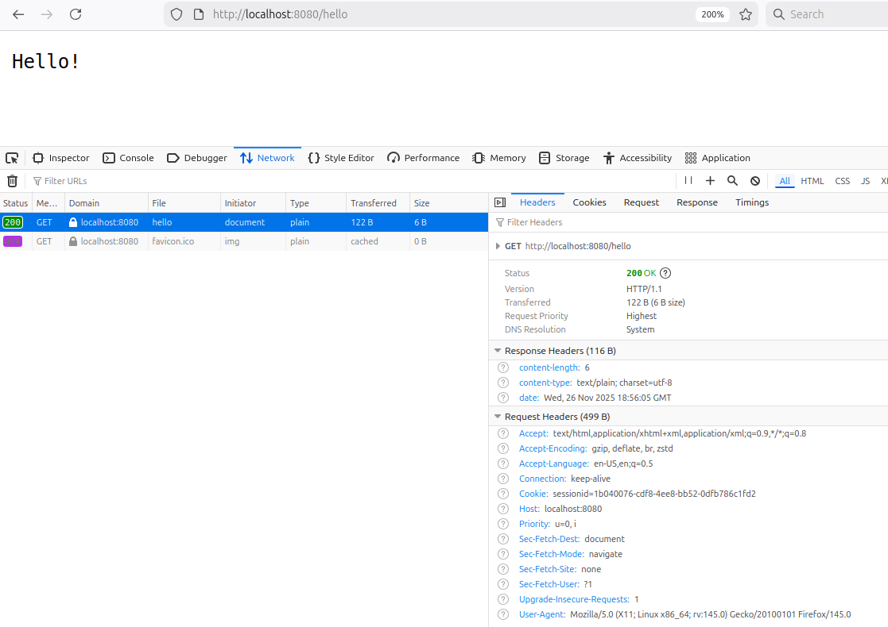

# Axum — основы

Итак, когда речь заходит о бекенд приложениях, первое, что приходит на ум — HTTP сервер. В этой и нескольких последующих главах мы подробно разберёмся с созданием HTTP сервера при помощи библиотеки Axum.

Axum — легковесный фрэймворк от создателей Tokio, предназначенный для создания HTTP серверов. Axum всецело опирается на асинхронные возможности Tokio, что делает его высокопроизводительным и, при этом, простым в использовании.

## Создание сервера

Начнём наше знакомство с Axum с простого примера: создадим HTTP сервер с одним эндпоинтом, который возвращает строку "Hello!".

Создадим новый Cargo проект:

```
cargo new test_axum
```

Далее добавим в `Cargo.toml` нужные зависимости:

```rust
[package]
name = "test_axum"
version = "0.1.0"
edition = "2024"

[dependencies]
tokio = { version = "1", features = ["full"] }
axum = "0.8"
serde = { version = "1", features = ["derive"] }
serde_json = "1"
```

Крэйт [axum](https://crates.io/crates/axum) содержит в себе основные компоненты для создания HTTP сервера. С крэйтами tokio и serde мы уже знакомы.


Далее `src/main.rs`: мы напишем сервер, который слушает порт 8080 и предоставляет эндпоинт, который доступен по URL пути `/hello` и HTTP методу GET.

```rust,noplayground
use axum::{Router, body::Body, http::StatusCode, response::Response, routing::get};

#[tokio::main]
async fn main() {
    // Создаём роутер, которые задаёт соответствие метод+путь -> обработчик запроса
    let app = Router::new()
        // Указываем, что для пути /hello и метода GET вызывается обработчик hello
        .route("/hello", get(hello));

    // Создаём слушатель порта 8080 по протоколу TCP
    let listener = tokio::net::TcpListener::bind("0.0.0.0:8080").await.unwrap();

    // запускаем HTTP сервер
    axum::serve(listener, app).await.unwrap();
}

// Обработчик запроса, который отвечает телом с текстом "Hello!"
// и заголовком: content-type: text/plain; charset=utf-8
async fn hello() -> Response {
    Response::builder()
        .status(StatusCode::OK)
        .header("content-type", "text/plain; charset=utf-8")
        .body(Body::new("Hello!".to_string()))
        .unwrap()
}
```

Теперь мы можем запустить наш сервер, как и любое другое Cargo приложение:

```
cargo run
```

После того как сервер запустится, мы можем в браузере перейти по адресу [http://localhost:8080/hello](http://localhost:8080/hello). Открывшаяся страница должна отобразить следующее:



Вот так просто, при помощи Axum, мы смогли создать полноценный HTTP сервер.

## Тип результата запроса

Для начала давайте разберём функцию-обработчик запроса из примера выше:

```rust,noplayground
async fn hello() -> Response {
    Response::builder()
        .status(StatusCode::OK)
        .header("content-type", "text/plain; charset=utf-8")
        .body(Body::new("Hello!".to_string()))
        .unwrap()
}
```

Тип [Response](https://docs.rs/axum/latest/axum/response/type.Response.html), представляющий HTTP ответ, должен быть интуитивно понятен: по аналогии с форматом HTTP ответа, он включает в себя код статуса ответа, заголовки и само тело ответа.

Не трудно заметить, что код для формирования объекта `Response` довольно громоздкий. Более того,  указывать код статуса в большинстве случаев излишне, так как в подавляющем большинстве случаев он будет равен 200. К тому же, значение заголовка "content-type" можно было бы автоматически вывести на основании содержимого ответа.

Именно поэтому функция-обработчик запроса может возвращать не только объект типа `Response`, но значения любых типов, которые реализуют трэйт [IntoResponse](https://docs.rs/axum/latest/axum/response/trait.IntoResponse.html).

Например, функцию-обработчик запроса _hello_ можно переписать так:

```rust,noplayground
async fn hello() -> &'static str {
    "Hello!"
}
```

Согласитесь, такая форма гораздо легче читается.

Мы смогли вернуть из функции-обработчика запроса значение типа `&'static str` потому, что существует реализация `IntoResponse` для `&'static str`.\
Для справки: она находится в крэйте [axum-core](https://github.com/tokio-rs/axum/tree/main/axum-core) в файле `src/response/into_reponse.rs`.

Также трэйт `IntoResponse` реализован еще для целого ряда типов, основные из которых:

* `()` — ответ с кодом 200 и пустым телом
* [HeaderMap](https://docs.rs/http/latest/http/header/struct.HeaderMap.html) — ответ с кодом 200, пустым телом и дополнительными заголовками
* `String` — ответ с кодом 200 и телом содержащим указанную строку
* [StatusCode](https://docs.rs/http/latest/http/status/struct.StatusCode.html) — ответ с указанными HTTP кодом и пустым телом
* `(StatusCode, impl IntoResponse)` — ответ с указанными HTTP кодом и телом, чей формат зависит от конкретного типа, реализующего трэйт `IntoResponse`
* `Result<T, E> where T: IntoResponse, E: IntoResponse` — и для Ok, и для Err ответ будет полностью зависеть от находящихся в них типов.\
  Например, для `Result<String, String>` при значении:
  * `Ok("good".to_string())` будет сформирован ответ с кодом 200 и телом, содержащим строку "good"
  * `Err("bad".to_string())` — будет сформирован ответ с кодом 200 (да, тоже 200) и телом, содержащим строку "bad".
* [Body](https://docs.rs/axum/latest/axum/body/struct.Body.html) — ответ с кодом 200 и телом, хранимым в объекте `Body`.
* `Vec<u8>` и `Box<[u8]>` — ответ с кодом 200, заголовком `content-type` равным `application/octet-stream` и телом, содержащим указанные байты.
* [Json\<T>](https://docs.rs/axum/latest/axum/struct.Json.html) — ответ с кодом 200, заголовком `content-type: application/json` и телом, содержащим текст с JSON представлением переданного значения.

Рассмотрим несколько примеров функций-обработчиков запроса:

```rust,noplayground
async fn handler_1() -> StatusCode {
    StatusCode::OK
}

async fn handler_2() -> (StatusCode, &'static str) {
    (StatusCode::OK, "Hello!")
}

async fn handler_3() -> Result<String, (StatusCode, String)> {
    Err((StatusCode::INTERNAL_SERVER_ERROR, "Some problem".to_string()))
}

async fn handler_4() -> Vec<u8> {
    vec![1,2,3]
}

use serde_json::{Value, json};
async fn handler_5() -> Json<Value> {
     Json(json!({"name": "John Doe"}))
}

use serde::{Deserialize, Serialize};
#[derive(Serialize, Deserialize)]
struct Person {
    name: String,
}
async fn handler_6() -> Json<Person> {
    Json(Person { name: "John Doe".to_string() })
}
```

## Замыкание как обработчик запроса

В качестве обработчика запроса можно использовать не только функции, но и замыкания.

```rust,noplayground
use axum::{Router, routing::get};

#[tokio::main]
async fn main() {
    // Значение, захватываемое замыканием
    let greeting = "Hello!".to_string();

    let app = Router::new()
        .route("/hello", get(async move || format!("{}", greeting)));
    let listener = tokio::net::TcpListener::bind("0.0.0.0:8080").await.unwrap();
    axum::serve(listener, app).await.unwrap();
}
```

Эндпоинт можно создать как из асинхронного замыкания:

```rust,noplayground
.route("/hello", get(async move || format!("{}", greeting)))
```

так и из замыкания, возвращающего фьючер:

```rust,noplayground
.route("/hello", get(|| async move { format!("{}", greeting) }))
```

> [!NOTE]
> К сожалению, ввиду реализации макросов в Axum в роутере можно использовать только замыкание, созданное непосредственно в той же функции, в которой и сам роутер.
> 
> То есть не получится написать такую функцию:
> 
> ```rust,noplayground
> fn make_hello_handler(greeting: String) -> impl AsyncFn() -> String {
>     async move || { format!("{}", greeting) }
> }
> ```
> 
> а потом использовать её в роутере так:
> 
> ```rust,noplayground
> let greeting = "Hello!".to_string();
> let closure = make_hello_handler(greeting);
> 
> let app = Router::new()
>     .route("/hello", get( closure));
> ```
> 
> В главе про [Tower](tower.md) мы узнаем как обойти это ограничение.

## Аргументы запроса

Существует два способа передачи аргументов через строку URL: параметры пути (path parameters) и параметры запроса (query parameters).

### Path parameters

Для того чтобы передать аргумент через URL путь, надо:

1.  в роутере, в желаемой части пути указать переменную

    ```rust,noplayground
    .route("/часть/пути/{переменная}", get(функция-обработчик запроса))
    ```
2.  В функции-обработчике запроса заинжектить аргумент посредством обёртки [Path](https://docs.rs/axum/latest/axum/extract/path/struct.Path.html).

    ```rust,noplayground
    async обработчик(переменная: Path<String>) -> Response { ... }
    ```

Для примера модифицируем наш hello эндпоинт так, чтобы он принимал имя того, кого надо поприветствовать.

```rust,noplayground
use axum::{Router, extract::Path, routing::get};

#[tokio::main]
async fn main() {
    let app = Router::new().route("/hello/{name}", get(hello));
    let listener = tokio::net::TcpListener::bind("0.0.0.0:8080").await.unwrap();
    axum::serve(listener, app).await.unwrap();
}

async fn hello(path_args: Path<String>) -> String {
    format!("Hello {}", path_args.0)
}
```

Теперь, если мы перейдём по адресу [http://localhost:8080/hello/Stas](http://localhost:8080/hello/Stas), то увидим приветствие "Hello Stas".

Если нужно передать несколько параметров через путь, то вместо одного значения в Path будет инжектиться кортеж со значениями.

```rust,noplayground
use axum::{Router, extract::Path, routing::get};

#[tokio::main]
async fn main() {
    let app = Router::new().route("/hello/{greeting}/{name}", get(hello));
    let listener = tokio::net::TcpListener::bind("0.0.0.0:8080").await.unwrap();
    axum::serve(listener, app).await.unwrap();
}

async fn hello(path_args: Path<(String, String)>) -> String {
    format!("{} {}", path_args.0.0, path_args.0.1)
}
```

Если мы перейдём по адресу [http://localhost:8080/hello/Aloha/Stas](http://localhost:8080/hello/Aloha/Stas), то должно отобразиться "Aloha Stas".

Для повышения читабельности кода для аргументов типа `Path` часто используют деструктурирование аргумента:

```rust,noplayground
async fn hello(Path((greeting, name)): Path<(String, String)>) -> String {
    format!("{greeting} {name}")
}
```

В процессе инжекции аргументы также могут быть преобразованы в числовой тип.
Например, создадим эндпоинт, который принимает два числа и возвращает их сумму:

```rust,noplayground
use axum::{Router, extract::Path, routing::get};

#[tokio::main]
async fn main() {
    let app = Router::new().route("/math/add/{arg1}/{arg2}", get(add));
    let listener = tokio::net::TcpListener::bind("0.0.0.0:8080").await.unwrap();
    axum::serve(listener, app).await.unwrap();
}

async fn add(Path((arg1, arg2)): Path<(i32, i32)>) -> String {
    format!("{arg1} + {arg2} = {}", arg1 + arg2)
}
```

Теперь, если перезапустить сервер и перейти по URL [http://localhost:8080/math/add/1/2](http://localhost:8080/math/add/1/2), то отобразится "1 + 2 = 3".

Если же в URL пути указать нечисловое значение, например [http://localhost:8080/math/add/1/ABC](http://localhost:8080/math/add/1/ABC), то полученный ответ будет иметь код 400, и содержать текстовое описание ошибки: "Invalid URL: Cannot parse value at index 1 with value `ABC` to a `i32`"

### Query parameters

Квери параметры обрабатываются немного проще: в функцию-обработчик запроса инжектится дополнительный аргумент — хеш-таблица, обёрнутая в тип [Query](https://docs.rs/axum/latest/axum/extract/struct.Query.html). Эта хеш-таблица и содержит в себе все квери параметры.

```rust,noplayground
async обработчик(Query(params): Query<HashMap<String, String>>) -> Response { ... }
```

Например, перепишем наш hello эндпоинт так, чтобы через квери параметры он принимал опциональный аргумент — имя того, кого надо поприветствовать. Если никакое имя передано не было, то будет отображаться просто "Hello!".

```rust,noplayground
use std::collections::HashMap;
use axum::{ Router, extract::Query, routing::get };

#[tokio::main]
async fn main() {
    let app = Router::new().route("/hello", get(hello));
    let listener = tokio::net::TcpListener::bind("0.0.0.0:8080").await.unwrap();
    axum::serve(listener, app).await.unwrap();
}

async fn hello(Query(params): Query<HashMap<String, String>>) -> String {
    match params.get("name") {
        Some(name) => format!("Hello, {}!", name),
        None => "Hello!".to_owned(),
    }
}
```

Теперь, если запустить сервер (`cargo run`) и открыть в браузере URL [http://localhost:8080/hello?name=Stas](http://localhost:8080/hello?name=Stas), то мы должны увидеть "Hello, Stas!". А если убрать квери параметр, т.е. перейти на  [http://localhost:8080/hello](http://localhost:8080/hello), то должно отобразиться просто "Hello!".

---

Альтернативно, квери параметры можно инжектить не в хеш-таблицу, а в структуру, где имена полей совпадают с именами ожидаемых квери параметров.

```rust,noplayground
use axum::{ Router, extract::Query, routing::get };

#[derive(serde::Deserialize)]
struct HelloParams {
    name: Option<String>,
}

#[tokio::main]
async fn main() {
    let app = Router::new().route("/hello", get(hello));
    let listener = tokio::net::TcpListener::bind("0.0.0.0:8080").await.unwrap();
    axum::serve(listener, app).await.unwrap();
}

async fn hello(Query(params): Query<HelloParams>) -> String {
    match params.name {
        Some(name) => format!("Hello, {}!", name),
        None => "Hello!".to_owned(),
    }
}
```

## Методы запроса

До этого момента мы использовали только GET метод запроса.

```rust,noplayground
let app = Router::new().route("/hello", get(hello));
```

Здесь `get(hello)` указывает, что функция hello должна быть использована в качестве обработчика запроса только в случае, если полученный HTTP запрос имел метод GET.

Если мы хотим, чтобы этот обработчик вызывался не для метода GET, а для POST, то мы должны написать:

```rust,noplayground
let app = Router::new().route("/hello", post(hello));
```

Если для одного и того же URL пути надо иметь несколько обработчиков для разных HTTP методов, например для GET вызывать функцию обработчик _list\_users_, а для POST — _create\_user_, то это можно задать так:

```rust,noplayground
let app = Router::new().route("/api/users", get(list_users).post(create_user));
```

Для каждого из HTTP методов имеется соответствующая функция в модуле [axum::routing](https://docs.rs/axum/latest/axum/routing/index.html): `get`, `post`, `put`, `delete`, `patch`, `head`, `option` и `trace`.

Также существует функция [axum::routing::any](https://docs.rs/axum/latest/axum/routing/method_routing/fn.any.html), которая позволяет вызывать обработчик для любого HTTP метода:

```rust,noplayground
let app = Router::new().route("/hello", any(hello));
```

## Чтение тела запроса { #read-request-body }

Как мы знаем, HTTP протокол позволяет передавать в запросе некие данные — тело запроса. Обычно тело содержится только в запросах с методами POST, PUT, PATCH.

Тело запроса может содержать данные в различных форматах (простой текст, JSON, XML, URL encoded данные, и т.д.), при этом тип формата принято передавать в HTTP заголовке `content-type`.

Чтобы получить содержимое тела запроса, нужно заинжектить его как аргумент в функцию-обработчик запроса. Например, если мы ожидаем, что запрос содержит в своём теле JSON документ, то мы можем заинжектить его как:

```rust,noplayground
async fn обработчик(Json(аргумент): Json<ТипСущности>) -> Response { ... }
```

Рассмотрим пример простого сервера, чей единственный эндпоинт принимает POST запрос с телом, представленным JSON документом, который содержит имя нового пользователя.

```rust,noplayground
use axum::{Json, Router, response::IntoResponse, routing::post};
use serde::Deserialize;

#[tokio::main]
async fn main() {
    let app = Router::new().route("/user", post(create_user));
    let listener = tokio::net::TcpListener::bind("0.0.0.0:8080").await.unwrap();
    axum::serve(listener, app).await.unwrap();
}

#[derive(Debug, Deserialize)]
struct CreateUserRequest {
    name: String,
}

async fn create_user(Json(input): Json<CreateUserRequest>) -> impl IntoResponse {
    format!("Created user: {input:?}")
}
```

Используя команду `cargo run`, запустим сервер и при помощи утилиты CURL протестируем наш эндпоинт:

```
$ curl -X POST -i -H 'content-type: application/json' \
    --data '{"name":"Stas"}' \
    http://localhost:8080/user
HTTP/1.1 200 OK
content-type: text/plain; charset=utf-8
content-length: 48
date: Sat, 29 Nov 2025 15:08:18 GMT

Created user: CreateUserRequest { name: "Stas" }
```

Как видите, функция обработчик корректно считывает JSON документ в объект структуры `CreateUserRequest`.

Если же мы попытаемся передать тело запроса в другом формате, например, URL encoded, то получим ответ с ошибкой:

```
$ curl -X POST -i -H 'content-type: application/x-www-form-urlencoded' \
    --data 'name=Stas' \
    http://localhost:8080/user
HTTP/1.1 415 Unsupported Media Type
content-type: text/plain; charset=utf-8
content-length: 54
date: Sat, 29 Nov 2025 15:05:19 GMT

Expected request with `Content-Type: application/json`
```

Чтобы считывать тело запроса в формате URL encoded нам придётся переписать наш обработчик так:

```rust,noplayground
async fn create_user(Form(input): Form<FormData>) -> impl IntoResponse {
    format!("Created user: {input:?}")
}
```

Как правило, поддержка нескольких форматов данных одним и тем же эндпоинтом не требуется. Однако в следующих главах мы рассмотрим, как её можно реализовать при необходимости.

## Разные типы результата

Иногда нам может понадобиться, в зависимости от значения каких-либо параметров, возвращать из обработчика значения разных типов. Например, либо JSON, либо простую строку, либо пустой ответ.

Так как тип результата функции может быть только один, мы не сможем возвращать из функции-обработчика одновременно объекты типов `JSON`, `String` и `()`. Поэтому нам придётся возвращать универсальный тип ответа — `Response`.

Модифицируем наш пример сервера с эндпоинтом, создающим нового пользователя:

* Если переданное имя пользователя пустое, то эндпоинт вернёт текстовое сообщение с ошибкой.
* Если переданное имя пользователя уже присутствует среди имеющихся пользователей, то эндпоинт вернёт ответ с пустым телом.
* Иначе эндпоинт вернёт JSON объект, содержащий имя созданного пользователя.

```rust,noplayground
use std::{collections::HashSet, sync::LazyLock};
use axum::{Json,Router,body::Body,http::StatusCode,response::Response,routing::post};
use serde::{Deserialize, Serialize};
use tokio::sync::Mutex;

static USERS: LazyLock<Mutex<HashSet<String>>> =
    LazyLock::new(|| Mutex::new(HashSet::new()));

#[tokio::main]
async fn main() {
    let app = Router::new().route("/user", post(create_user));
    let listener = tokio::net::TcpListener::bind("0.0.0.0:8080").await.unwrap();
    axum::serve(listener, app).await.unwrap();
}

#[derive(Deserialize)]
struct CreateUserRequest { name: String }

#[derive(Serialize)]
struct CreateUserResponse { name: String }

async fn create_user(Json(input): Json<CreateUserRequest>) -> Response {
    if input.name.is_empty() {
        return Response::builder()
            .status(StatusCode::BAD_REQUEST)
            .header("content-type", "text/plain; charset=utf-8")
            .body(Body::new("Empty name".to_string()))
            .unwrap();
    }
    let mut guard = USERS.lock().await;
    if guard.contains(&input.name) {
        Response::builder()
            .status(StatusCode::OK)
            .body(Body::empty())
            .unwrap()
    } else {
        guard.insert(input.name.clone());
        Response::builder()
            .status(StatusCode::CREATED)
            .header("content-type", "application/json; charset=utf-8")
            .body(Body::new(serde_json::to_string(
                &CreateUserResponse { name: input.name }
            ).unwrap()))
            .unwrap()
    }
}
```

Эндпоинт работает так, как и от него ожидалось:

```
$ curl -X POST -i -H 'content-type: application/json' --data '{"name":"Stas"}' \
    http://localhost:8080/user
HTTP/1.1 201 Created
content-type: application/json; charset=utf-8
content-length: 15

{"name":"Stas"}

$ curl -X POST -i -H 'content-type: application/json' --data '{"name":"Stas"}' \
    http://localhost:8080/user
HTTP/1.1 200 OK
content-length: 0


$ curl -X POST -i -H 'content-type: application/json' --data '{"name":""}' \
    http://localhost:8080/user
HTTP/1.1 400 Bad Request
content-type: text/plain; charset=utf-8
content-length: 10

Empty name
```

Однако, нетрудно заметить, что большую часть кода функции-обработчика занимает громоздкое формирование объектов `Response`. Здесь на помощь опять приходит трэйт `IntoResponse`. Чтобы получить объект `Response`, мы будем вручную вызывать определённый в нём метод `into_reponse()`.

```rust,noplayground
async fn create_user(Json(input): Json<CreateUserRequest>) -> Response {
    if input.name.is_empty() {
        return (StatusCode::BAD_REQUEST, "Empty name").into_response();
    }
    let mut guard = USERS.lock().await;
    if guard.contains(&input.name) {
        ().into_response()
    } else {
        guard.insert(input.name.clone());
        let created_user = CreateUserResponse { name: input.name };
        (StatusCode::CREATED, Json(created_user)).into_response()
    }
}
```

Таким образом, мы смогли сделать код обработчика вдвое короче.

### HTTP заголовки запроса

В функцию-обработчик запроса можно заинжектить не только аргументы пути и квери параметры, но и HTTP заголовки запроса. Делается это при помощи типа обёртки [HeaderMap](https://docs.rs/ajars_axum/latest/ajars_axum/axum/http/header/struct.HeaderMap.html).

Например, так мы можем считать все HTTP заголовки, полученные в запросе:

```rust,noplayground
use axum::{Router, http::HeaderMap, routing::get};

#[tokio::main]
async fn main() {
    let app = Router::new().route("/hello", get(hello));
    let listener = tokio::net::TcpListener::bind("0.0.0.0:8080").await.unwrap();
    axum::serve(listener, app).await.unwrap();
}

async fn hello(headers: HeaderMap) -> String {
    let headers_string = headers
        .iter()
        .map(|(h, v)|
            format!("{}={}", h.as_str(), String::from_utf8_lossy(v.as_bytes()))
        )
        .collect::<Vec<_>>()
        .join(",");
    format!("Headers: {headers_string}")
}

```

Если перейти по адресу [http://localhost:8080/hello](http://localhost:8080/hello), то мы должны увидеть что-то наподобие:

Headers: host=localhost:8080,user-agent=Mozilla/5.0 (X11; Linux x86\_64; rv:145.0) Gecko/20100101 Firefox/145.0,accept=text/html,application/xhtml+xml,application/xml;q=0.9,_/_;q=0.8,accept-language=en-US,en;q=0.5,accept-encoding=gzip, deflate, br, zstd,connection=keep-alive,cookie=sessionid=1b040076-cdf8-4ee8-bb52-0dfb786c1fd2,upgrade-insecure-requests=1,sec-fetch-dest=document,sec-fetch-mode=navigate,sec-fetch-site=none,sec-fetch-user=?1,priority=u=0, i

***

Также можно заинжектить целиком весь объект, представляющий заголовочную часть HTTP запроса. Делается это при помощи типа [Parts](https://docs.rs/http/latest/http/request/struct.Parts.html), который выглядит так:

```rust,noplayground
pub struct Parts {
    pub method: Method,
    pub uri: Uri,
    pub version: Version,
    pub headers: HeaderMap<HeaderValue>,
    pub extensions: Extensions,
}
```

Заинжектив объект `Parts`, мы сможем получить доступ не только к HTTP заголовкам запроса, но и к методу запроса и к URL пути.

```rust,noplayground
use axum::{Router, http::request::Parts, routing::get};

#[tokio::main]
async fn main() {
    let app = Router::new().route("/hello", get(hello));
    let listener = tokio::net::TcpListener::bind("0.0.0.0:8080").await.unwrap();
    axum::serve(listener, app).await.unwrap();
}

async fn hello(parts: Parts) -> String {
    let headers_string = parts.headers
        .iter()
        .map(|(h, v)| format!("{}={}", h.as_str(), String::from_utf8_lossy(v.as_bytes())))
        .collect::<Vec<_>>()
        .join(",");
    format!(
        "Method: {}\nURL: {}\nHeaders: {}",
        parts.method, parts.uri, headers_string
    )
}
```

Ответ от эндпоинта [http://localhost:8080/hello](http://localhost:8080/hello):

> Method: GET\
> URL: /hello\
> Headers: host=localhost:8080,user-agent=Mozilla/5.0 (X11; Linux x86_64; rv:147.0) Gecko/20100101 Firefox/147.0,accept=text/html,application/xhtml+xml,application/xml;q=0.9,*/*;q=0.8,accept-language=en-US,en;q=0.9,accept-encoding=gzip, deflate, br, zstd,connection=keep-alive,referer=http://localhost:3000/,cookie=sessionid=1b040076-cdf8-4ee8-bb52-0dfb786c1fd2,upgrade-insecure-requests=1,sec-fetch-dest=document,sec-fetch-mode=navigate,sec-fetch-site=same-site,sec-fetch-user=?1,priority=u=0, i


