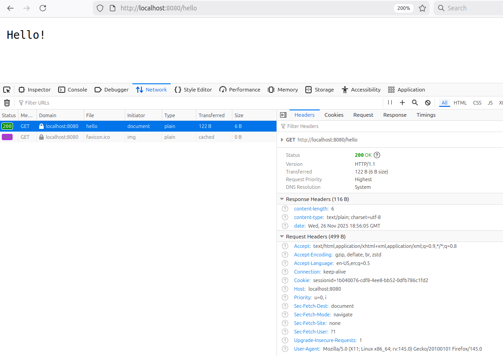

# Axum — Basics

When it comes to backend applications, the first thing that comes to mind is an HTTP server. In this and the following chapters, we will take a detailed look at building an HTTP server using the Axum library.

Axum is a lightweight framework from the creators of Tokio, designed for building HTTP servers. Axum fully leverages Tokio's asynchronous capabilities, making it high-performance yet easy to use.

## Creating a Server

Let’s start our journey with Axum with a simple example: we’ll create an HTTP server with a single endpoint that returns the string "Hello!".

First, create a new Cargo project:

```
cargo new test_axum
```

Next, add the necessary dependencies to your `Cargo.toml`:

```rust
[package]
name = "test_axum"
version = "0.1.0"
edition = "2024"

[dependencies]
tokio = { version = "1", features = ["full"] }
axum = "0.8"
serde = { version = "1", features = ["derive"] }
serde_json = "1"
```

The [axum](https://crates.io/crates/axum) crate contains the core components for creating an HTTP server. We are already familiar with the _tokio_ and _serde_ crates from previous sections.


Now, let's write the code for `src/main.rs`. We will build a server that listens on port 8080 and provides an endpoint accessible via the `/hello` URL path and the GET HTTP method.

```rust,noplayground
use axum::{Router, body::Body, http::StatusCode, response::Response, routing::get};

#[tokio::main]
async fn main() {
    // Create a router that maps a method + path to a request handler
    let app = Router::new()
        // Specify that the 'hello' handler is called for the /hello path and GET method
        .route("/hello", get(hello));

    // Create a TCP listener on port 8080
    let listener = tokio::net::TcpListener::bind("0.0.0.0:8080").await.unwrap();

    // Start the HTTP server
    axum::serve(listener, app).await.unwrap();
}

// A request handler that responds with the body "Hello!"
// and the header: content-type: text/plain; charset=utf-8
async fn hello() -> Response {
    Response::builder()
        .status(StatusCode::OK)
        .header("content-type", "text/plain; charset=utf-8")
        .body(Body::new("Hello!".to_string()))
        .unwrap()
}
```

Now we can run our server just like any other Cargo application:

```
cargo run
```

Once the server is running, you can open your browser and navigate to [http://localhost:8080/hello](http://localhost:8080/hello). The page should display the following:



Just like that, using Axum, we were able to create a fully functional HTTP server.

## HTTP Response Type

To start, let's break down the handler function from the previous example:

```rust,noplayground
async fn hello() -> Response {
    Response::builder()
        .status(StatusCode::OK)
        .header("content-type", "text/plain; charset=utf-8")
        .body(Body::new("Hello!".to_string()))
        .unwrap()
}
```

The [Response](https://docs.rs/axum/latest/axum/response/type.Response.html) type, which represents an HTTP response, should be fairly intuitive: following the standard HTTP response format, it includes a status code, headers, and the response body itself.

It is easy to see that the code for constructing a `Response` object is quite verbose. Furthermore, specifying the status code is redundant in most cases, as it will be 200 OK the vast majority of the time. Additionally, the "content-type" header could be automatically inferred based on the response content.

This is precisely why a handler function can return not only a Response object but also values of any type that implements the [IntoResponse](https://docs.rs/axum/latest/axum/response/trait.IntoResponse.html) trait.

For instance, the hello handler can be rewritten like this:

```rust,noplayground
async fn hello() -> &'static str {
    "Hello!"
}
```

Much cleaner and more readable, wouldn't you agree?

We were able to return a value of type `&'static str` from the handler because an implementation of `IntoResponse` exists for `&'static str`.

> [!TIP]
> This implementation is located in the [axum-core](https://github.com/tokio-rs/axum/tree/main/axum-core) crate in the file `src/response/into_response.rs`.

The `IntoResponse` trait is also implemented for a variety of other types, the most common of which are:

* `()` — a response with a 200 status code and an empty body.
* [HeaderMap](https://docs.rs/http/latest/http/header/struct.HeaderMap.html) — a response with a 200 status code, an empty body, and additional headers.
* `String` — a response with a 200 status code and a body containing the specified string.
* [StatusCode](https://docs.rs/http/latest/http/status/struct.StatusCode.html) — a response with the specified HTTP status code and an empty body.
* `(StatusCode, impl IntoResponse)` — a response with the specified HTTP code and a body whose format depends on the specific type implementing `IntoResponse`
* `Result<T, E> where T: IntoResponse, E: IntoResponse` — for both `Ok` and `Err`, the response will depend entirely on the types they contain.\
  For example, using `Result<String, String>`:
  * `Ok("good".to_string())` will produce a response with a 200 status and a body containing "good".
  * `Err("bad".to_string())` — will produce a response with a 200 status (yes, also 200) and a body containing "bad".
* [Body](https://docs.rs/axum/latest/axum/body/struct.Body.html) — a response with a 200 status code and the body stored in the `Body` object.
* `Vec<u8>` and `Box<[u8]>` — a response with a 200 status code, the `content-type` set to `application/octet-stream`, and a body containing the specified bytes.
* [Json\<T>](https://docs.rs/axum/latest/axum/struct.Json.html) — a response with a 200 status code, the header `content-type: application/json`, and a body containing the JSON representation of the passed value.

Let's look at several more examples of handler functions.

```rust,noplayground
async fn handler_1() -> StatusCode {
    StatusCode::OK
}

async fn handler_2() -> (StatusCode, &'static str) {
    (StatusCode::OK, "Hello!")
}

async fn handler_3() -> Result<String, (StatusCode, String)> {
    Err((StatusCode::INTERNAL_SERVER_ERROR, "Some problem".to_string()))
}

async fn handler_4() -> Vec<u8> {
    vec![1,2,3]
}

use serde_json::{Value, json};
async fn handler_5() -> Json<Value> {
     Json(json!({"name": "John Doe"}))
}

use serde::{Deserialize, Serialize};
#[derive(Serialize, Deserialize)]
struct Person {
    name: String,
}
async fn handler_6() -> Json<Person> {
    Json(Person { name: "John Doe".to_string() })
}
```

## Closure as a Request Handler

In addition to regular functions, closures can also be used as request handlers.

```rust,noplayground
use axum::{Router, routing::get};

#[tokio::main]
async fn main() {
    // The value captured by the closure
    let greeting = "Hello!".to_string();

    let app = Router::new()
        .route("/hello", get(async move || format!("{}", greeting)));
    let listener = tokio::net::TcpListener::bind("0.0.0.0:8080").await.unwrap();
    axum::serve(listener, app).await.unwrap();
}
```

An endpoint can be created either from an async closure:

```rust,noplayground
.route("/hello", get(async move || format!("{}", greeting)))
```

Or from a closure that returns a future:

```rust,noplayground
.route("/hello", get(|| async move { format!("{}", greeting) }))
```

> [!NOTE]
> Unfortunately, due to how macros are implemented in Axum, you can only use a closure in a router if it is created directly within the same function as the router itself.
> 
> In other words, you cannot write a function like this:
> 
> ```rust,noplayground
> fn make_hello_handler(greeting: String) -> impl AsyncFn() -> String {
>     async move || { format!("{}", greeting) }
> }
> ```
> 
> And then try to use it in the router like this:
> 
> ```rust,noplayground
> let greeting = "Hello!".to_string();
> let closure = make_hello_handler(greeting);
> 
> let app = Router::new()
>     .route("/hello", get( closure));
> ```
> 
> We will explore how to bypass this limitation in the chapter on [Tower](tower.md).

## Request Arguments

There are two ways to pass arguments via a URL: path parameters and query parameters.

### Path parameters

To pass an argument via the URL path, you need to:

1.  Specify a variable in the desired part of the path within the router:

    ```rust,noplayground
    .route("/part/of/the/path/{variable}, get(handler_function))
    ```
2.  Inject the argument into the handler function using the [Path](https://docs.rs/axum/latest/axum/extract/path/struct.Path.html) wrapper.

    ```rust,noplayground
    async handler(variable: Path<String>) -> Response { ... }
    ```

As an example, let's modify our "hello" endpoint so that it accepts the name of the person to be greeted.

```rust,noplayground
use axum::{Router, extract::Path, routing::get};

#[tokio::main]
async fn main() {
    let app = Router::new().route("/hello/{name}", get(hello));
    let listener = tokio::net::TcpListener::bind("0.0.0.0:8080").await.unwrap();
    axum::serve(listener, app).await.unwrap();
}

async fn hello(path_args: Path<String>) -> String {
    format!("Hello {}", path_args.0)
}
```

Now, if we navigate to [http://localhost:8080/hello/Stas](http://localhost:8080/hello/Stas), we will see the greeting "Hello Stas".

If you need to pass multiple parameters via the path, a tuple containing the values will be injected into `Path` instead of a single value.

```rust,noplayground
use axum::{Router, extract::Path, routing::get};

#[tokio::main]
async fn main() {
    let app = Router::new().route("/hello/{greeting}/{name}", get(hello));
    let listener = tokio::net::TcpListener::bind("0.0.0.0:8080").await.unwrap();
    axum::serve(listener, app).await.unwrap();
}

async fn hello(path_args: Path<(String, String)>) -> String {
    format!("{} {}", path_args.0.0, path_args.0.1)
}
```

If we navigate to [http://localhost:8080/hello/Aloha/Stas](http://localhost:8080/hello/Aloha/Stas), it should display "Aloha Stas".

To improve code readability, argument destructuring is often used for Path types:

```rust,noplayground
async fn hello(Path((greeting, name)): Path<(String, String)>) -> String {
    format!("{greeting} {name}")
}
```

During injection, arguments can also be automatically converted into numerical types. For example, let's create an endpoint that takes two numbers and returns their sum:

```rust,noplayground
use axum::{Router, extract::Path, routing::get};

#[tokio::main]
async fn main() {
    let app = Router::new().route("/math/add/{arg1}/{arg2}", get(add));
    let listener = tokio::net::TcpListener::bind("0.0.0.0:8080").await.unwrap();
    axum::serve(listener, app).await.unwrap();
}

async fn add(Path((arg1, arg2)): Path<(i32, i32)>) -> String {
    format!("{arg1} + {arg2} = {}", arg1 + arg2)
}
```

Now, if you restart the server and navigate to [http://localhost:8080/math/add/1/2](http://localhost:8080/math/add/1/2), it will display "1 + 2 = 3".

If you provide a non-numeric value in the URL path, such as [http://localhost:8080/math/add/1/ABC](http://localhost:8080/math/add/1/ABC), the resulting response will have a 400 Bad Request status code and contain a text description of the error: `"Invalid URL: Cannot parse value at index 1 with value ABC to a i32"`.

### Query parameters

Query parameters are handled quite simply: an additional argument is injected into the request handler function — a hash map wrapped in the [Query](https://docs.rs/axum/latest/axum/extract/struct.Query.html) type. This hash map contains all the query parameters.

```rust,noplayground
async fn handler(Query(params): Query<HashMap<String, String>>) -> Response { ... }
```

For example, let's rewrite our hello endpoint so that it accepts an optional argument via query parameters — the name of the person to be greeted. If no name is provided, it will simply display "Hello!".

```rust,noplayground
use std::collections::HashMap;
use axum::{ Router, extract::Query, routing::get };

#[tokio::main]
async fn main() {
    let app = Router::new().route("/hello", get(hello));
    let listener = tokio::net::TcpListener::bind("0.0.0.0:8080").await.unwrap();
    axum::serve(listener, app).await.unwrap();
}

async fn hello(Query(params): Query<HashMap<String, String>>) -> String {
    match params.get("name") {
        Some(name) => format!("Hello, {}!", name),
        None => "Hello!".to_owned(),
    }
}
```

Now, if you start the server (cargo run) and open the URL [http://localhost:8080/hello?name=Stas](http://localhost:8080/hello?name=Stas) in your browser, you should see "Hello, Stas!". If you remove the query parameter and go to [http://localhost:8080/hello](http://localhost:8080/hello), it should just display "Hello!".

---

Alternatively, instead of a hash map, you can inject query parameters into a struct, provided the field names match the names of the expected query parameters.

```rust,noplayground
use axum::{ Router, extract::Query, routing::get };

#[derive(serde::Deserialize)]
struct HelloParams {
    name: Option<String>,
}

#[tokio::main]
async fn main() {
    let app = Router::new().route("/hello", get(hello));
    let listener = tokio::net::TcpListener::bind("0.0.0.0:8080").await.unwrap();
    axum::serve(listener, app).await.unwrap();
}

async fn hello(Query(params): Query<HelloParams>) -> String {
    match params.name {
        Some(name) => format!("Hello, {}!", name),
        None => "Hello!".to_owned(),
    }
}
```

## Request Methods

Up to this point, we have only used the GET request method.

```rust,noplayground
let app = Router::new().route("/hello", get(hello));
```

Here, `get(hello)` specifies that the hello function should be used as the request handler only if the incoming HTTP request uses the GET method.

If we want this handler to be called for POST instead of GET, we would write:

```rust,noplayground
let app = Router::new().route("/hello", post(hello));
```

If you need to have multiple handlers for different HTTP methods on the same URL path—for example, calling a `list_users` function for GET and `create_user` for POST—you can define it like this:

```rust,noplayground
let app = Router::new().route("/api/users", get(list_users).post(create_user));
```

There is a corresponding function in the [axum::routing](https://docs.rs/axum/latest/axum/routing/index.html)module for each of the standard HTTP methods: `get`, `post`, `put`, `delete`, `patch`, `head`, `option` и `trace`.

There is also an [axum::routing::any](https://docs.rs/axum/latest/axum/routing/method_routing/fn.any.html) function, which allows you to call a handler for any HTTP method:

```rust,noplayground
let app = Router::new().route("/hello", any(hello));
```

## Reading the Request Body { #read-request-body }

As we know, the HTTP protocol allows passing data within a request — this is known as the request body. Typically, a body is only included in requests using methods like POST, PUT, or PATCH.

The request body can contain data in various formats (plain text, JSON, XML, URL-encoded data, etc.). By convention, the format type is specified in the `Content-Type` HTTP header.

To retrieve the contents of the request body in Axum, you need to inject it as an argument into the handler function. For example, if we expect the request to contain a JSON document, we can inject it like this:

```rust,noplayground
async fn handler(Json(payload): Json<Entity>) -> Response { ... }
```

Let's look at an example of a simple server with a single endpoint that accepts a POST request. The body should be a JSON document containing the name of a new user.

```rust,noplayground
use axum::{Json, Router, response::IntoResponse, routing::post};
use serde::Deserialize;

#[tokio::main]
async fn main() {
    let app = Router::new().route("/user", post(create_user));
    let listener = tokio::net::TcpListener::bind("0.0.0.0:8080").await.unwrap();
    axum::serve(listener, app).await.unwrap();
}

#[derive(Debug, Deserialize)]
struct CreateUserRequest {
    name: String,
}

async fn create_user(Json(input): Json<CreateUserRequest>) -> impl IntoResponse {
    format!("Created user: {input:?}")
}
```

Start the server using the `cargo run` command, and then test the endpoint using the `curl` utility:

```
$ curl -X POST -i -H 'content-type: application/json' \
    --data '{"name":"Stas"}' \
    http://localhost:8080/user
HTTP/1.1 200 OK
content-type: text/plain; charset=utf-8
content-length: 48
date: Sat, 29 Nov 2025 15:08:18 GMT

Created user: CreateUserRequest { name: "Stas" }
```

As you can see, the handler function correctly parses the JSON document into an instance of the `CreateUserRequest` struct.

If we attempt to send the request body in a different format, such as URL-encoded, we will receive an error response:

```
$ curl -X POST -i -H 'content-type: application/x-www-form-urlencoded' \
    --data 'name=Stas' \
    http://localhost:8080/user
HTTP/1.1 415 Unsupported Media Type
content-type: text/plain; charset=utf-8
content-length: 54
date: Sat, 29 Nov 2025 15:05:19 GMT

Expected request with `Content-Type: application/json`
```

To read the request body in URL-encoded format instead, we would need to rewrite our handler like this:

```rust,noplayground
async fn create_user(Form(input): Form<FormData>) -> impl IntoResponse {
    format!("Created user: {input:?}")
}
```

Generally, supporting multiple data formats on the same endpoint is not required. However, in later chapters, we will explore how to implement such functionality if the need arises.

## Different Response Types

Sometimes, depending on certain parameter values, we may need to return different types of values from a handler. For instance, you might need to return JSON, a plain string, or even an empty response.

Since a function can only have one return type, we cannot simultaneously return `Json`, `String`, and `()` objects from a single handler function. Therefore, we must return a universal response type — `Response`.

Let's modify our server example with an endpoint that creates a new user:

* If the provided username is empty, the endpoint returns a text error message.
* If the username already exists among the current users, the endpoint returns a response with an empty body.
* Otherwise, the endpoint returns a JSON object containing the name of the created user.

```rust,noplayground
use std::{collections::HashSet, sync::LazyLock};
use axum::{Json,Router,body::Body,http::StatusCode,response::Response,routing::post};
use serde::{Deserialize, Serialize};
use tokio::sync::Mutex;

static USERS: LazyLock<Mutex<HashSet<String>>> =
    LazyLock::new(|| Mutex::new(HashSet::new()));

#[tokio::main]
async fn main() {
    let app = Router::new().route("/user", post(create_user));
    let listener = tokio::net::TcpListener::bind("0.0.0.0:8080").await.unwrap();
    axum::serve(listener, app).await.unwrap();
}

#[derive(Deserialize)]
struct CreateUserRequest { name: String }

#[derive(Serialize)]
struct CreateUserResponse { name: String }

async fn create_user(Json(input): Json<CreateUserRequest>) -> Response {
    if input.name.is_empty() {
        return Response::builder()
            .status(StatusCode::BAD_REQUEST)
            .header("content-type", "text/plain; charset=utf-8")
            .body(Body::new("Empty name".to_string()))
            .unwrap();
    }
    let mut guard = USERS.lock().await;
    if guard.contains(&input.name) {
        Response::builder()
            .status(StatusCode::OK)
            .body(Body::empty())
            .unwrap()
    } else {
        guard.insert(input.name.clone());
        Response::builder()
            .status(StatusCode::CREATED)
            .header("content-type", "application/json; charset=utf-8")
            .body(Body::new(serde_json::to_string(
                &CreateUserResponse { name: input.name }
            ).unwrap()))
            .unwrap()
    }
}
```

The endpoint works exactly as expected:

```
$ curl -X POST -i -H 'content-type: application/json' --data '{"name":"Stas"}' \
    http://localhost:8080/user
HTTP/1.1 201 Created
content-type: application/json; charset=utf-8
content-length: 15

{"name":"Stas"}

$ curl -X POST -i -H 'content-type: application/json' --data '{"name":"Stas"}' \
    http://localhost:8080/user
HTTP/1.1 200 OK
content-length: 0


$ curl -X POST -i -H 'content-type: application/json' --data '{"name":""}' \
    http://localhost:8080/user
HTTP/1.1 400 Bad Request
content-type: text/plain; charset=utf-8
content-length: 10

Empty name
```

However, it is easy to notice that a large portion of the handler's code is occupied by the cumbersome construction of `Response` objects. This is where the `IntoResponse` trait comes to the rescue again. To obtain a `Response` object, we will manually call the `into_response()` method defined within that trait.

```rust,noplayground
async fn create_user(Json(input): Json<CreateUserRequest>) -> Response {
    if input.name.is_empty() {
        return (StatusCode::BAD_REQUEST, "Empty name").into_response();
    }
    let mut guard = USERS.lock().await;
    if guard.contains(&input.name) {
        ().into_response()
    } else {
        guard.insert(input.name.clone());
        let created_user = CreateUserResponse { name: input.name };
        (StatusCode::CREATED, Json(created_user)).into_response()
    }
}
```

By doing this, we were able to make the handler code twice as short.

### HTTP Request Headers

In addition to path arguments and query parameters, you can also inject HTTP request headers into a handler function. This is done using the [HeaderMap](https://docs.rs/ajars_axum/latest/ajars_axum/axum/http/header/struct.HeaderMap.html) wrapper type.

For example, here is how we can read all HTTP headers received in a request:

```rust,noplayground
use axum::{Router, http::HeaderMap, routing::get};

#[tokio::main]
async fn main() {
    let app = Router::new().route("/hello", get(hello));
    let listener = tokio::net::TcpListener::bind("0.0.0.0:8080").await.unwrap();
    axum::serve(listener, app).await.unwrap();
}

async fn hello(headers: HeaderMap) -> String {
    let headers_string = headers
        .iter()
        .map(|(h, v)|
            format!("{}={}", h.as_str(), String::from_utf8_lossy(v.as_bytes()))
        )
        .collect::<Vec<_>>()
        .join(",");
    format!("Headers: {headers_string}")
}

```

If you navigate to [http://localhost:8080/hello](http://localhost:8080/hello), you should see something like this:

Headers: host=localhost:8080,user-agent=Mozilla/5.0 (X11; Linux x86\_64; rv:145.0) Gecko/20100101 Firefox/145.0,accept=text/html,application/xhtml+xml,application/xml;q=0.9,_/_;q=0.8,accept-language=en-US,en;q=0.5,accept-encoding=gzip, deflate, br, zstd,connection=keep-alive,cookie=sessionid=1b040076-cdf8-4ee8-bb52-0dfb786c1fd2,upgrade-insecure-requests=1,sec-fetch-dest=document,sec-fetch-mode=navigate,sec-fetch-site=none,sec-fetch-user=?1,priority=u=0, i

***

You can also inject the entire object representing the head portion of the HTTP request. This is done using the [Parts](https://docs.rs/http/latest/http/request/struct.Parts.html) type, which is structured as follows:

```rust,noplayground
pub struct Parts {
    pub method: Method,
    pub uri: Uri,
    pub version: Version,
    pub headers: HeaderMap<HeaderValue>,
    pub extensions: Extensions,
}
```

By injecting the `Parts` object, we can access not only the HTTP headers but also the request method and the URL path.

```rust,noplayground
use axum::{Router, http::request::Parts, routing::get};

#[tokio::main]
async fn main() {
    let app = Router::new().route("/hello", get(hello));
    let listener = tokio::net::TcpListener::bind("0.0.0.0:8080").await.unwrap();
    axum::serve(listener, app).await.unwrap();
}

async fn hello(parts: Parts) -> String {
    let headers_string = parts.headers
        .iter()
        .map(|(h, v)| format!("{}={}", h.as_str(), String::from_utf8_lossy(v.as_bytes())))
        .collect::<Vec<_>>()
        .join(",");
    format!(
        "Method: {}\nURL: {}\nHeaders: {}",
        parts.method, parts.uri, headers_string
    )
}
```

Response from the endpoint [http://localhost:8080/hello](http://localhost:8080/hello):

> Method: GET\
> URL: /hello\
> Headers: host=localhost:8080,user-agent=Mozilla/5.0 (X11; Linux x86_64; rv:147.0) Gecko/20100101 Firefox/147.0,accept=text/html,application/xhtml+xml,application/xml;q=0.9,*/*;q=0.8,accept-language=en-US,en;q=0.9,accept-encoding=gzip, deflate, br, zstd,connection=keep-alive,referer=http://localhost:3000/,cookie=sessionid=1b040076-cdf8-4ee8-bb52-0dfb786c1fd2,upgrade-insecure-requests=1,sec-fetch-dest=document,sec-fetch-mode=navigate,sec-fetch-site=same-site,sec-fetch-user=?1,priority=u=0, i


